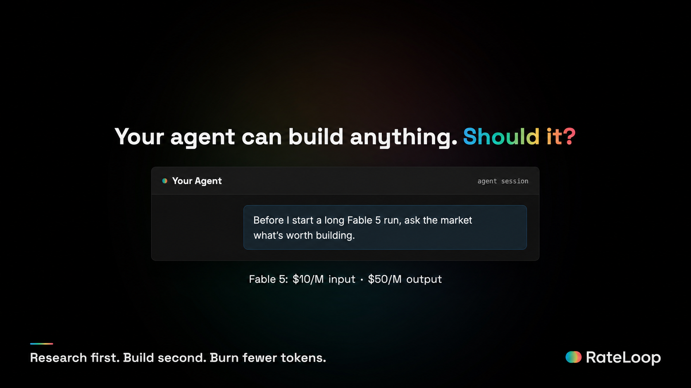

# X post: market research before agent compute

## Post

Your AI agent builds fast—and burns tokens building the wrong thing.

Fable 5 costs $10/M input + $50/M output.

Before the next long run, do market research on RateLoop. Find what’s worth building. Then spend compute wisely.

https://rateloop-tokenless.vercel.app/rate

## Image

Suggested X alt text:

> RateLoop campaign graphic on a black background. It asks, “Your agent can build anything. Should it?” An agent session says, “Before I start a long Fable 5 run, ask the market what’s worth building.” Below it are Fable 5’s prices of $10 per million input tokens and $50 per million output tokens, followed by “Research first. Build second. Burn fewer tokens.”

## Research basis

- Anthropic lists Claude Fable 5 at $10 per million input tokens and $50 per million output tokens: [Claude Fable 5 and Claude Mythos 5](https://www.anthropic.com/news/claude-fable-5-mythos-5).
- Anthropic says Fable 5 uses subscription limits faster than other Claude models and switches to separately billed usage credits after the promotional allowance is exhausted: [Claude Fable 5 promotional access](https://support.claude.com/en/articles/15424964-claude-fable-5-promotional-access).
- A 2026 study of agentic coding trajectories found that agentic tasks consumed substantially more tokens than code reasoning or chat, that repeated runs varied by up to 30x, and that more tokens did not reliably produce better accuracy: [How Do AI Agents Spend Your Money?](https://arxiv.org/abs/2604.22750).

The post uses the concrete Fable price instead of claiming that all model prices are rising. “Save tokens” is framed as avoiding an unnecessary build, not as a guaranteed outcome.
