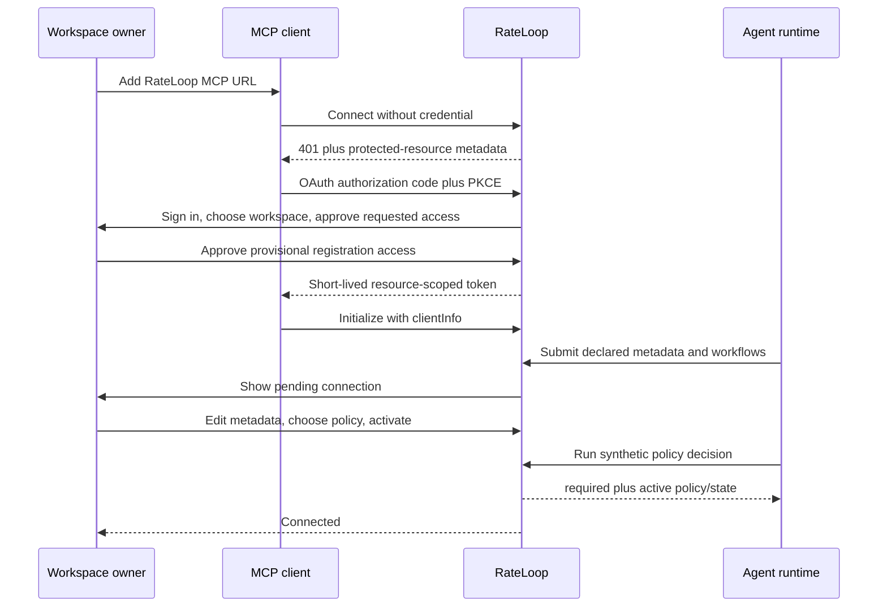
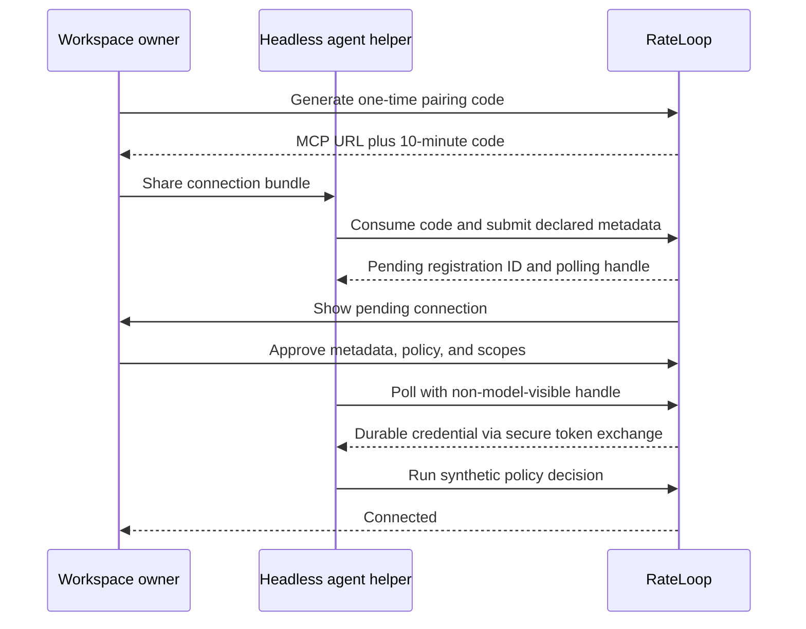

# Tokenless agent self-registration and adaptive review research (July 2026)

**Status:** Research and product recommendation. This document does not amend the tokenless design of record until the
decision is accepted in the relevant implementation plan.

## Executive recommendation

RateLoop should replace the current manual **Register agent** form with a **Connect an agent** flow.

The preferred interactive flow is:

1. the user gives the agent only the RateLoop MCP URL, or uses a client-specific install action;
2. the MCP client opens a normal OAuth browser approval;
3. the user selects the workspace and grants bounded registration/review scopes;
4. the agent reports the metadata it actually knows and creates a pending registration;
5. the user reviews or edits the declared identity and chooses a review policy;
6. RateLoop binds the resulting credential to one agent, one immutable agent version, and one current owner-approved
   policy;
7. the integration becomes **Connected** only after a successful policy-decision test.

For a custom or headless agent that cannot complete browser OAuth, RateLoop may generate a short-lived pairing code that
the user shares with the agent. That code must only permit a pending registration request. It must not read workspace
data, publish a review, spend funds, or become the permanent credential.

The adaptive-review decision must remain server-controlled. The runtime calls RateLoop for every eligible opportunity;
RateLoop returns `required`, `recommended`, or `skip` from the frozen owner policy and current evidence. The model must
not decide for itself that it has received enough positive feedback.

This makes the user's proposed mental model possible while preserving the actual trust boundary:

> Connect this agent to my workspace, let it describe itself, let me approve what it may do, and let RateLoop decide how
> often humans should review each class of output.

## 1. What is possible

### 1.1 Agent-initiated registration is possible

An MCP client sends `clientInfo` and client capabilities during initialization. The protocol exposes the MCP client
implementation name, title, version, and capabilities, and permits server instructions that clients may add to model
context. It does not standardize a trustworthy declaration of the underlying model, deployment, prompt, or business
workflow. Those values can be proposed by the agent, but must remain labeled **declared** unless separately attested.

RateLoop can therefore prefill:

- MCP client and version from `initialize.clientInfo`;
- supported MCP capabilities from the initialization request;
- a suggested display name, purpose, provider, model, deployment, environment, and workflow list from a narrowly
  scoped registration call;
- a stable external ID from the host integration or an owner-approved generated value.

The user should edit or confirm these values. The initial screen should not demand model-version details the runtime
cannot know.

### 1.2 An MCP URL plus OAuth is more user-friendly than a permanent shared secret

The current MCP authorization specification uses OAuth 2.1-style discovery and protected-resource metadata. It
recommends Client ID Metadata Documents for clients and servers without a prior relationship, permits dynamic client
registration as a fallback, requires PKCE for authorization-code protection, and requires access tokens in the
`Authorization` header rather than the URL.

This matches current client behavior:

- Codex supports Streamable HTTP MCP servers, bearer-token authentication, OAuth authentication, and MCP server
  instructions. Its CLI and desktop/IDE surfaces share MCP configuration.
- Claude Code supports remote HTTP MCP servers and browser OAuth, with stored token refresh and re-authentication.
- VS Code handles configured MCP OAuth in the browser on first connection.
- Custom headless clients vary. A device-style flow or confidential client credential can be offered separately instead
  of weakening the interactive OAuth path.

The easiest supported-client experience should therefore be **URL -> browser approval -> connected**, with no durable
secret copied through chat.

### 1.3 A pairing code is still useful as a fallback

OAuth Device Authorization Grant provides a proven pattern for an input-constrained or browserless client: the client
holds a high-entropy device code while a person approves a corresponding request in a browser. RateLoop's user-generated
pairing idea reverses who starts the request, but should preserve the same security properties:

- short expiry;
- one use;
- online rate limiting;
- an explicit browser approval;
- no authority before approval;
- a separate durable credential after approval.

The copyable bundle may look like:

```text
Connect to my RateLoop workspace.
MCP: https://rateloop-tokenless.vercel.app/api/agent/v1/mcp
Pairing code: pair_...

Use the RateLoop connection flow. This code expires in 10 minutes and can only request registration.
```

The pairing code should be passed to a RateLoop helper or MCP host integration, not returned in a model-visible tool
result alongside a permanent access token. After approval, the helper or OAuth client stores the durable credential in
the platform credential store, keychain, or server secret manager.

### 1.4 MCP instructions help, but they are not enforcement

MCP `InitializeResult.instructions` can tell the model how the server should be used. Codex explicitly reads these
server instructions as cross-tool guidance. The MCP specification nevertheless describes instructions and resource/tool
descriptions as hints that clients may incorporate.

RateLoop should use instructions such as:

> Before releasing an eligible output or action, call `rateloop_evaluate_review_requirement`. Do not infer the current
> review rate locally. If review is required, request it and wait for the configured terminal result before continuing.

This improves discovery, but it cannot prove compliance. RateLoop should distinguish:

- **Advisory integration:** the model is instructed to call RateLoop;
- **Host-enforced integration:** application middleware, a hook, or an agent framework calls RateLoop at the actual
  pre-output/pre-action boundary.

Only the second state can honestly claim that every eligible opportunity reaches the policy engine. A generic chat MCP
connection should not be displayed as host-enforced without observed evidence from the runtime.

## 2. Adaptive review: positive feedback may reduce sampling, not eliminate it

The user's example is directionally correct. If humans consistently agree with an agent for a narrowly comparable class
of work, RateLoop should ask humans less often. It should not conclude that repeated thumbs-up responses prove universal
correctness.

There are four reasons:

1. agreement is not the same as correctness, safety, or truth;
2. reviewers can rubber-stamp an automated suggestion or exhibit automation bias;
3. a model, prompt, workflow, input population, or environment can drift;
4. stopping review entirely removes the labels needed to detect future deterioration.

NIST's AI RMF calls for ongoing monitoring, periodic review, explicit human-AI roles, and mechanisms to incorporate
adjudicated feedback. Experimental research has also found that merely placing a human in the loop does not guarantee
effective correction and can produce over-reliance on algorithmic recommendations. Concept-drift research supports
continued detection, understanding, and adaptation rather than treating historical performance as permanently stable.

### Recommended default state machine

Preserve the accepted RateLoop design and current service direction:

| Stage           | Human review rate | Entry requirement                                                |
| --------------- | ----------------: | ---------------------------------------------------------------- |
| Calibrating     |              100% | New agent/version/scope; at least 30 completed comparable cases  |
| High coverage   |               50% | 95% Wilson lower bound clears threshold across two valid windows |
| Medium coverage |               25% | Another 50 stable comparable cases                               |
| Monitoring      |               10% | Another 100 stable comparable cases                              |

The policy is partitioned by:

```text
agent version x workflow/template x risk tier x audience policy
```

Strong feedback on low-risk release-note copy must not reduce review of a high-risk support refund or production change.

Review remains 100% when:

- the risk tier is critical;
- required metadata is missing or unknown;
- the owner has selected **Always review**;
- a rule explicitly matches;
- a new model, deployment, material prompt, workflow, group, or policy version appears;
- agreement, human-human agreement, completion, latency, or drift gates fail;
- an incident or severe disagreement is open.

Even the monitoring stage retains random forced samples. A user may raise the floor; reducing below the default 10%
requires a deliberate risk decision and must never apply to critical rules.

### Feedback quality must be measured

An unbroken sequence of `yes` or thumbs-up responses is not sufficient for stepping down. RateLoop should require:

- a minimum count of completed, comparable cases;
- the lower confidence bound rather than the raw positive percentage;
- enough responding humans for the configured audience;
- human-human agreement when multiple reviewers participate;
- rationale or structured evidence when the policy requires it;
- response-quality and suspicious-speed checks;
- honest treatment of abstain, inconclusive, and insufficient-response outcomes;
- a privacy-minimized record of skipped opportunities so coverage and selection bias remain visible.

RateLoop should describe the metric as **human agreement with the agent suggestion**, never accuracy or truth.

## 3. Current repository assessment

The repository already contains much of the adaptive core, but not the connection product.

Implemented:

- durable workspace agents and immutable versions in `drizzle/0030_durable_agent_registry.sql`;
- manual registry UI and owner/admin mutation controls;
- publishing policies and hash-only workspace API keys;
- versioned review-policy, opportunity, scope, observation, rollup, and policy-event tables in
  `drizzle/0031_adaptive_review_evidence.sql`;
- a transactional adaptive decision service with idempotent opportunities, agent/version/policy checks, deterministic
  sampling, 100/50/25/10 review stages, Wilson intervals, critical-risk forcing, and missing-metadata resets;
- an authenticated workspace MCP with `rateloop_get_assurance_state` and
  `rateloop_evaluate_review_requirement`.

Missing or disconnected:

- no `tokenless_agent_integrations` table binding an agent/version to a credential, publishing policy, review policy,
  webhook, project, client type, and enforcement mode;
- no OAuth protected-resource metadata, authorization server, PKCE connection flow, or workspace consent screen for the
  authenticated MCP;
- no pairing-session service;
- registration does not ingest MCP `clientInfo` or self-declared metadata;
- no connection test, `lastSeenAt`, observed client version, credential rotation, or connected/disconnected state;
- no owner-facing review-policy CRUD/UI even though the tables and decision service exist;
- the current policy-bound credential issuance does not bind an agent/version and omits `evaluation:read` and
  `review:decide`;
- the current decision request requires the caller to supply agent, version, policy ID, and policy version instead of
  deriving them from an authenticated integration binding;
- the authenticated MCP lacks the proposed request-review, wait, result, and manual-handoff tools;
- `/docs/ai` primarily documents the separate public, approval-bound MCP rather than this workspace registration path.

The design plan anticipated the missing middle: its agent form includes identity, integration, review mode, audience,
timing/panel, and spend/privacy sections, and it calls for agent-to-key/policy/webhook/project bindings plus connection
state and rotation. The current implementation stopped after several individual layers rather than composing the
connection journey.

## 4. Proposed user experience

### 4.1 Replace “Register agent” with “Connect an agent”

The first screen should ask only:

1. **How is the agent running?** Codex, Claude, VS Code/Copilot, custom MCP, SDK/API, or another client.
2. **Where should the connection apply?** This project/workspace or all workspaces supported by that client.

It then provides the shortest supported action:

- an install/open action when the client supports it;
- one copyable command plus OAuth for a CLI;
- a copyable MCP configuration plus OAuth for an editor;
- a pairing bundle only for a browserless/custom client;
- SDK middleware instructions for a custom service that needs host-enforced review.

Do not ask the user to fill provider, model, deployment, and technical IDs before the agent has connected.

### 4.2 Show a pending connection card

After the first connection, show:

```text
Connection request
Codex CLI 1.x on project RateLoop
Declared model: gpt-... (unattested)
Workflows proposed: code change, release review
Enforcement: advisory / host-enforced

[Review and connect] [Reject]
```

The user then confirms:

- display name and stable external ID;
- declared provider/model/deployment/environment;
- responsible owner;
- permitted workflows and risk tiers;
- manual, always, rules-based, or adaptive review;
- private group/public/hybrid audience;
- privacy, timing, panel, and spending limits;
- requested scopes, expiry, and webhook/project bindings.

Advanced fields remain collapsed unless the user chooses custom configuration.

### 4.3 Offer understandable policy presets

Recommended presets:

- **Learn from feedback (recommended):** 100% while calibrating, then 50%, 25%, and 10% after evidence gates.
- **Always ask humans:** every eligible opportunity is reviewed.
- **Ask for risky cases:** owner-defined rules plus a monitoring sample for other cases.
- **Manual only:** the agent creates an approval-bound browser handoff only when asked.

The UI should preview the rule in plain language:

> For low-risk support drafts, ask humans on every case until 30 comparable results exist. Reduce gradually only when
> the lower confidence bound remains above 85%. Continue auditing at least 10%. Always review refunds, safety issues,
> missing metadata, and new model versions.

### 4.4 Finish with a real connection test

The success screen should not say **Registered** after a database insert. It should run a synthetic, no-cost test:

1. credential authenticates;
2. integration binding resolves the workspace, agent, version, and policy server-side;
3. `rateloop_evaluate_review_requirement` records an idempotent synthetic opportunity;
4. the returned decision and assurance state match the policy;
5. the agent reports the connection as ready.

Only then show:

```text
Connected
Policy active: Learn from feedback v1
Stage: Calibrating - 100% review
Last seen: just now
Enforcement: Host-enforced
Credential: rlk_abcd... - expires 14 Oct 2026
```

### 4.5 Make owner changes immediate and server-derived

The agent should not cache a mutable copy of the policy as authority. On each opportunity, RateLoop derives the active
agent/version and policy from the integration principal. A user policy change creates a new immutable version and applies
to new opportunities on the next request; existing in-flight reviews retain their frozen version.

This means the user can change the review rate, add a critical rule, revoke a credential, or deactivate the agent without
editing the agent's prompt. The next server call observes the change.

## 5. Connection flows

### 5.1 Interactive OAuth flow



The provisional token is inactive for review publishing until owner activation. It can report client metadata and read
its own connection status only.

### 5.2 Pairing fallback



## 6. Proposed authorization and data model

### 6.1 Pairing sessions

Add `tokenless_agent_pairing_sessions` with at least:

- `pairing_id`, `workspace_id`, `code_hash`, display prefix, creator, created/expiry/consumed timestamps;
- status: `issued`, `consumed`, `pending_approval`, `approved`, `rejected`, `expired`;
- requested client type and maximum requested scopes;
- pending-registration ID and rate-limit/audit metadata;
- no raw code after issuance.

The code should be random, copyable, hashed at rest, valid for about ten minutes, single-use, and incapable of reading or
mutating workspace resources beyond submitting one pending registration.

### 6.2 Integration bindings

Implement the planned `tokenless_agent_integrations` table:

- workspace, agent, immutable version, status, and owner;
- OAuth grant or API-key reference, never a raw secret;
- client implementation/name/version and last-seen time;
- `advisory` or `host_enforced` enforcement mode plus attestation/evidence reference when available;
- current review-policy ID/version and publishing-policy ID/version;
- project, webhook, audience, and allowed workflow bindings;
- scopes, expiry, revoked-at, rotation lineage, and audit events;
- last successful decision/request/result timestamps and stable error state.

An integration credential belongs to exactly one workspace integration. It must not be a generic workspace key that lets
the caller choose an arbitrary `agentId`.

### 6.3 OAuth requirements

For interactive MCP clients:

- implement protected-resource and authorization-server metadata discovery;
- use authorization code with PKCE and exact redirect validation;
- support public clients without requiring a client secret;
- prefer Client ID Metadata Documents, with pre-registration and dynamic registration only where needed;
- issue short-lived, audience-restricted, least-privilege access tokens;
- rotate or sender-constrain refresh tokens;
- store opaque token hashes or validated signed-token identifiers, not recoverable bearer secrets;
- never place bearer access or refresh tokens in query strings, fragments, copied MCP URLs, logs, or model-visible tool
  output.

The current thirdweb/RateLoop browser session may authenticate the owner at the consent screen, but it is not itself the
MCP resource token. Browser identity, owner approval, integration binding, and MCP authorization remain separate facts.

## 7. Proposed MCP contract

### Registration-only state

- `rateloop_submit_agent_registration`: submit declared metadata and proposed workflows;
- `rateloop_get_connection_status`: read only this provisional integration's status;
- no workspace listing, evaluation data, private content, publishing, payment, group, or invitation access.

### Active state

- `rateloop_get_agent_context`: return the credential-derived agent/version and non-secret active policy summary;
- `rateloop_evaluate_review_requirement`: accept only opportunity ID, workflow/risk metadata, suggestion commitment,
  evidence reference, confidence, and completeness flags; derive agent/version/policy from the principal;
- `rateloop_request_review`: accept the frozen decision ID and review payload;
- `rateloop_wait_for_review`;
- `rateloop_get_review_result`;
- `rateloop_create_manual_handoff` for policy misses or manual mode;
- `rateloop_get_assurance_state` for the integration's permitted scopes.

The server should expose concise initialization instructions and useful tool descriptions. The policy decision must be
the source of truth, so a stale prompt or cached assurance-state display cannot bypass a new owner rule.

## 8. Security and abuse boundaries

- A pairing code is an invitation to request registration, not a bearer API key.
- User approval is required after the agent supplies its metadata; possession of the code alone is insufficient.
- Provider/model identity remains declared unless attested by a supported provider or host.
- Registration scopes do not imply review publishing or payment scopes.
- Spending requires a separate frozen publishing policy and the existing prepaid/x402 controls.
- Revocation must fail the next request, not merely hide the integration in the UI.
- Cross-workspace IDs supplied by a client are ignored or rejected; binding comes from the authenticated principal.
- Policy changes, credential rotation, activation, rejection, and every adaptive stage transition are append-only audit
  events.
- Public MCP remains the four-tool, approval-bound handoff lane and does not accept workspace pairing codes.
- Pairing, OAuth, and authenticated MCP remain isolated to the `rateloop-tokenless` project and domain.

## 9. Recommended implementation sequence

Keep each concern in a separate commit:

1. **`docs(product): accept agent connection and pairing model`**
   Amend the accepted product plan and define advisory versus host-enforced registration.
2. **`feat(db): add agent pairing and integration bindings`**
   Add forward-only pairing, integration, rotation, and audit tables.
3. **`feat(auth): add workspace MCP OAuth discovery and consent`**
   Add protected-resource metadata, authorization metadata, PKCE, bounded scopes, token rotation, and revocation.
4. **`feat(api): add pending agent self-registration`**
   Ingest client metadata, declared agent metadata, and one-time pairing fallback without granting operational scopes.
5. **`feat(agents-ui): connect and approve agents`**
   Replace the form-first experience with client selection, pending approval, progressive disclosure, and connection
   status.
6. **`feat(policy): manage agent review policies`**
   Add owner CRUD/versioning for manual, always, rules, and adaptive modes plus understandable presets.
7. **`feat(mcp): bind decisions to agent integrations`**
   Derive identity/policy from the principal and add request, wait, result, and handoff tools.
8. **`feat(agents): add secure pairing and host middleware`**
   Add client-specific setup, secure credential storage, and an enforceable pre-output/pre-action SDK wrapper.
9. **`test(e2e): verify agent connect and adaptive review`**
   Exercise OAuth, pairing, approval, rejection, rotation, revocation, calibration, step-down, forced samples, drift reset,
   policy changes, and cross-tenant denial.

## 10. Acceptance criteria

The feature is complete only when:

- a supported interactive client can connect with the MCP URL and browser OAuth without copying a permanent secret;
- a headless client can request registration with a short-lived code that grants no workspace or spending access;
- agent metadata is prefilled, clearly marked declared, editable, and owner-approved;
- the issued credential is bound to one workspace, agent, immutable version, and policy;
- the agent cannot select a different agent or policy by changing request fields;
- the UI distinguishes pending, connected, advisory, host-enforced, disconnected, expired, and revoked states;
- the dashboard shows last seen, client version, active policy, stage, review rate, and actionable failures;
- every eligible opportunity reaches the policy service in host-enforced mode, including skipped opportunities;
- repeated positive feedback steps only the matching scope from 100% to 50%, 25%, and 10% after evidence gates;
- critical risk and missing metadata remain at 100%;
- model/workflow/policy/drift changes reset the matching scope;
- revocation blocks the next MCP/API call;
- no bearer or refresh token appears in a URL, model transcript, normal log, or general workspace response;
- a full browser E2E proves connect -> approve -> decide -> review -> result -> adapt -> revoke.

## Sources

- [MCP authorization specification, 2025-11-25](https://modelcontextprotocol.io/specification/2025-11-25/basic/authorization)
- [MCP schema: initialization, client information, capabilities, and server instructions](https://modelcontextprotocol.io/specification/2025-06-18/schema)
- [OAuth 2.0 Device Authorization Grant, RFC 8628](https://datatracker.ietf.org/doc/html/rfc8628)
- [OAuth 2.0 Security Best Current Practice, RFC 9700](https://www.rfc-editor.org/rfc/rfc9700.html)
- [OAuth 2.0 for Native Apps, RFC 8252](https://www.rfc-editor.org/info/rfc8252/)
- [Codex MCP manual](https://learn.chatgpt.com/docs/extend/mcp.md)
- [Claude Code MCP documentation](https://code.claude.com/docs/en/mcp)
- [VS Code MCP configuration reference](https://code.visualstudio.com/docs/agents/reference/mcp-configuration)
- [NIST AI RMF Core](https://airc.nist.gov/airmf-resources/airmf/5-sec-core/)
- [Putting a human in the loop: Increasing uptake, but decreasing accuracy of automated decision-making](https://journals.plos.org/plosone/article?id=10.1371/journal.pone.0298037)
- [Learning under Concept Drift: A Review](https://arxiv.org/abs/2004.05785)
