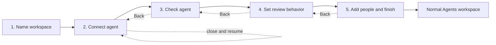

# Guided workspace and agent setup plan

- **Status:** Proposed
- **Date:** 2026-07-15
- **Scope:** First workspace creation, first agent connection, agent confirmation, review authority, spending limits,
  private-group invitations, setup resumption, and the transition into the normal Agents workspace
- **Design relationship:** This plan extends the concise progressive-disclosure UX and the accepted one-message agent
  connection. It does not change the safe connection profile, OAuth boundary, fund core, paid-eligibility rules, or
  deployment isolation. If accepted, its product decisions should be folded into
  [`tokenless-immutable-implementation-plan-2026-07.md`](tokenless-immutable-implementation-plan-2026-07.md).

## 1. Recommendation

Add a **resumable, workspace-scoped, five-stage setup** that owns the first journey through `/agents`:

1. Name workspace
2. Connect agent
3. Check agent
4. Set review behavior
5. Add people and finish

The setup replaces the normal Agents workspace tabs until it is deliberately completed. It keeps RateLoop's global
desktop rail and mobile header available, so the user is not trapped and can still reach Humans, Docs, legal pages, and
account controls. "Normal menu" therefore means the Agents workspace navigation — Overview, Agents, Groups, and
Evaluations — not the global product shell.

The safe connection remains operational as soon as OAuth connection verification succeeds. Setup completion does not
mint authority. It confirms the connected identity, records the owner's intended review behavior, optionally performs a
separate browser step-up for publishing and spending, and records what the owner decided about invited reviewers.



This is a first-workspace setup, not a permanent lock on management. Adding a second agent should use a shorter guided
connection-and-confirmation flow inside the completed workspace and must not re-lock the whole Agents area.

## 2. Research translated into RateLoop decisions

The recommendation is based on these patterns:

- [Shopify's onboarding guidance](https://shopify.dev/docs/apps/design/user-experience/onboarding) recommends brief,
  direct setup, discrete steps that complete automatically, visible progress, asking only for necessary information,
  and no more than five steps. It also recommends a later option for genuinely non-essential work.
- [Carbon's progress indicator guidance](https://carbondesignsystem.com/components/progress-indicator/usage/) uses a
  progress indicator for a linear process with at least three steps, shows completed/current/future state, validates a
  step before advancing, and pairs the indicator with Back/Next navigation.
- [The U.S. Web Design System step indicator](https://designsystem.digital.gov/components/step-indicator/) reinforces
  that the indicator reports location but does not replace Back/Next navigation; it also requires explicit headings,
  textual completion state, and `aria-current` rather than color alone.
- [GOV.UK's complete-multiple-tasks pattern](https://design-system.service.gov.uk/patterns/complete-multiple-tasks/)
  recommends persisted statuses and a clear return point for work spanning sessions. RateLoop should borrow the resume
  behavior, but not turn this short, mostly linear setup into a large task-list dashboard.
- [GitHub App installation guidance](https://docs.github.com/en/apps/using-github-apps/about-using-github-apps) separates
  installation from permission review, and [GitHub's installed-app management](https://docs.github.com/en/apps/using-github-apps/reviewing-and-modifying-installed-github-apps)
  lets owners review and change access later. RateLoop should likewise keep safe connection separate from later
  publishing, spending, and private-data authority.

The resulting pattern is a short linear setup with automatic completion where the system has evidence, explicit owner
confirmation where the system does not, and a persisted return point for the external agent-connection step.

## 3. Current product findings

The current code already contains most domain capabilities, but they are composed as unrelated management surfaces:

| Current behavior | Evidence in the current code | Product consequence |
| --- | --- | --- |
| No workspace shows the workspace form; creation redirects directly back to Agents | `WorkspaceSettingsClient.tsx` | Workspace naming is already a good first step, but no durable setup record is created. |
| A workspace without a usable connection shows only `AgentConnectionPanel` | `AgentWorkspacePanels.tsx` | The initial focus is correct. |
| A usable connection immediately causes `AgentTabs` to appear | `agents/page.tsx`, `AgentWorkspacePanels.tsx`, `agentWorkspaceState.ts` | Connection is incorrectly treated as the end of onboarding. |
| The one-message safe connection creates an agent/version plus a private-invited adaptive review policy automatically | `agentConnectionIntents.ts` | Setup has a safe provisional identity and policy to review; it must not ask the owner to rebuild them from scratch. |
| The automatically created version uses host/client name and `unknown` provider/model values | `agentConnectionIntents.ts` | Owner confirmation is needed, but provider/model fields must remain explicitly declared or unknown rather than implied attestation. |
| Connected identity and policy details are behind separate Manage disclosures and panels | `AgentConnectionPanel.tsx`, `AgentRegistryPanel.tsx`, `AgentReviewPolicyPanel.tsx`, `AgentPublishingPolicyPanel.tsx` | A first-time owner must discover the correct order and understand internal concepts before the workspace is usable. |
| Spending limits exist only in the autonomous-publishing editor | `AgentPublishingPolicyPanel.tsx` | The relevant high-risk choice is available, but too late and mixed with technical policy fields. |
| Groups and invitation codes exist as another independent tab | `PrivateGroupsPanel.tsx` | The natural next action after choosing invited reviewers is not connected to the setup journey. |
| Onboarding observability ends at `connected` | `onboardingObservability.ts` | RateLoop cannot measure whether owners confirm the agent, configure behavior, invite people, or finish. |
| Private/hybrid autonomous review publication is rejected before an ask is created | `adaptiveReviewOrchestration.ts` | The UI must not promise that a connected agent can already send private or hybrid review work to invited people. |

The last finding is a release boundary, not a copy issue. The current adaptive request path accepts a public publication
declaration only and deliberately returns `private_assignment_lane_unavailable` for private or hybrid policies. Private
groups and assignment-gated assurance machinery exist elsewhere, but they are not connected to this autonomous agent
path.

## 4. Target owner journey

### Stage 1 — Name workspace

Keep the current single field and primary action.

- Heading: **Name your workspace**
- Required input: workspace name
- Primary action: **Create workspace**
- Completion evidence: active workspace plus owner membership
- Result: create the setup record and route to `/agents/setup?workspace=<id>&step=connect`

Do not show billing, groups, agent registry, policies, or technical settings here.

### Stage 2 — Connect agent

Reuse the accepted one-message flow in a setup presentation mode.

- Heading: **Connect your agent**
- Primary action: **Copy connection message**
- While active: show the server-owned connection state and one recovery action
- Completion evidence: active integration, `connection_status = connected`, and successful non-mutating verification
- Result: advance automatically to **Check agent** and announce the transition once

The safe profile remains exactly `connection:claim`, `context:read`, `evaluation:read`, and `review:decide`. It cannot
publish, pay, read private artifacts, or administer the workspace. Setup must not add a second approval for that same safe
connection.

The user may close the page. Returning to `/agents` resumes this workspace at the active connection state or the earliest
incomplete stage.

### Stage 3 — Check agent

Show a short owner-facing summary of what RateLoop actually learned:

- Editable display name
- Observed host/client and version, read-only
- Connection status and safe access summary, read-only
- Optional description
- **Declared details** disclosure for provider, model, model version, deployment name, and environment

Required action: **Confirm agent**.

Do not force an owner to guess provider/model data. Unknown values are acceptable and remain labelled as unknown. If the
owner changes any identity field, create a new immutable agent version and atomically rebind the integration and its
review policy. If nothing changed, record confirmation of the existing version without creating version noise.

Completion evidence is an owner-confirmed version ID bound to the connected integration.

### Stage 4 — Set review behavior

This stage should use plain-language decisions and progressive disclosure. The default remains safe and does not grant
autonomous publishing.

1. **When should it use human review?**
   - **When RateLoop says review is needed** — recommended adaptive policy
   - **For every eligible output**
   - **Only after I approve a request**
2. **Who should answer?**
   - People I invite
   - RateLoop reviewer network
   - Both
3. **What may be shared?**
   - Public, synthetic, or safely redacted material
   - Private workspace material
4. **Can the agent send and pay for review requests without asking each time?**
   - **No — ask me first** — default; keep the safe connection scopes
   - **Yes — within limits** — requires a separate confirmation and operational reviewer lane

If autonomous access is selected, reveal only:

- maximum per request;
- daily limit;
- monthly limit;
- payment source when more than one usable source exists; and
- what happens above the limit, defaulting to **Ask me for approval**.

Do not pre-authorize an amount through an unexamined default. Require the owner to enter and confirm the three USDC
limits. Keep response count, fee ceiling, wallet address, workflow keys, retention, and other advanced constraints out of
the first-run form unless the selected payment method or enforced policy truly requires them.

The server, not the owner, must derive and freeze the audience-policy hash. The current raw **Audience policy binding**
input is an implementation detail and must not appear in setup.

The UI must show only reviewer/content combinations that are operational in the current environment:

| Reviewer choice | Content allowed in the autonomous lane | Release rule |
| --- | --- | --- |
| RateLoop network | Public, synthetic, or safely redacted only | Hide until network panels and the applicable paid mechanism/integrity gate are enabled. |
| Invited people | Private or public material through assignment-gated private artifacts | Do not enable autonomous sending until the private-group agent lane is implemented. |
| Both | Public material with separately frozen invited/network subpanels | Hide until both lanes and the paid hybrid mechanism are release-ready. |

Choosing an unavailable lane must fail closed on the server even if a stale client submits it. The setup should not show
disabled future-product options merely to advertise them.

Completion evidence is an active review-policy version bound to the confirmed agent version. If autonomous access was
chosen, it additionally requires an active publishing policy, exact policy/version binding, exact allowed workflows,
browser-recorded owner consent, and an available runtime lane.

### Stage 5 — Add people and finish

Keep this fifth stage in the progress indicator for every user so the number of stages does not change after Stage 4.
Change the body according to the selected audience:

- **Invited or hybrid audience:** offer a default private group and one short invitation action. The common path is an
  optional recipient email or a one-use code with the existing seven-day expiry. Put domain/account binding,
  redemptions, and membership expiry under **Invitation restrictions**.
- **Public-only audience:** state that no private invitations are needed and show the final setup summary.
- **Safe connection without autonomous sending:** allow **Invite later**. Record the decision and state that the agent can
  decide when review is needed but cannot reach invited reviewers until a group and runnable request lane exist.
- **Autonomous private sending:** require an active group and at least one active invitation or member before finish.

The same screen ends with a compact summary of agent, review behavior, audience, content boundary, and autonomous spend
limits. The final primary action is **Finish setup**; there is no sixth review step.

Setup is complete only when the server transaction revalidates every referenced artifact and records the owner/admin who
finished it. Invitation redemption itself is not a setup requirement; a visible post-setup readiness warning remains
until at least one invited reviewer joins.

## 5. Navigation, progress, and resumption

Use a semantic ordered list with the fixed labels **Workspace**, **Connect**, **Agent**, **Reviews**, and **People**.

- Show `Step N of 5` plus a real page heading.
- Mark completed, current, and not-started states in text as well as visually.
- Put `aria-current="step"` on the current item and announce completion state to screen readers.
- Use separate **Back** and **Continue** buttons. The progress component is not the only navigation.
- Let users open previously completed stages; do not let a URL or click skip an incomplete prerequisite.
- Persist each stage before navigation. Browser Back must not discard a completed server mutation.
- On workspace switch, resolve and show that workspace's own setup state.
- Focus the new stage heading after client-side navigation without stealing focus during background connection polling.

The server computes `resumeStep` as the earliest incomplete prerequisite. `currentStep` is only the last useful return
point; it cannot override missing or invalid artifacts.

## 6. Setup state and domain invariants

Add the next ordered migration after the current `0050` journal, tentatively
`0051_workspace_agent_setup.sql`, with one row per workspace:

| Field | Purpose |
| --- | --- |
| `workspace_id` | Primary key and workspace foreign key |
| `schema_version` | Version of the setup contract |
| `status` | `in_progress`, `completed`, or `grandfathered` |
| `current_step` | Last useful resume point |
| `primary_integration_id` | First connected integration used by setup |
| `confirmed_agent_version_id` | Exact owner-confirmed identity version |
| `review_draft_json` | Non-sensitive, validated choices saved before materialization |
| `review_policy_id` / `review_policy_version` | Exact active review binding |
| `publishing_policy_id` / `publishing_policy_version` | Nullable elevated-access binding |
| `people_decision` | `invited`, `later`, or `not_required` |
| `private_group_id` | Nullable group selected/created during setup |
| `revision` | Optimistic concurrency token |
| `completed_at` / `completed_by` | Explicit completion receipt |
| timestamps | Creation and last update |

The row stores user intent and evidence references, not duplicated authorization truth. A server resolver joins the
workspace, membership, connection, integration, agent version, review policy, publishing policy, group, and invitation
state to derive each stage status.

Never store connection messages, claim fragments, OAuth tokens, API credentials, invite tokens, question content, or
private artifacts in the setup row or onboarding analytics.

Dependency rules:

- Revoking the integration before setup completion returns the workspace to **Connect agent**.
- Changing confirmed identity during setup invalidates the Review and People confirmations and creates immutable
  version/policy records rather than mutating history.
- Changing reviewer audience invalidates the people decision and any publishing-policy draft derived from it.
- After setup completion, later revocation or policy expiry is operational health, not first-run onboarding. Keep the
  normal menu visible and show a recovery banner so the owner can reconnect or change policy.
- Adding later agents does not change workspace setup status.
- A non-owner/non-admin cannot mutate setup. They see the current stage and **Ask a workspace owner to finish setup**.

## 7. Service and API shape

Create a `workspaceAgentSetup.ts` service as the only coordinator for the setup transaction graph. UI components must not
sequence several existing APIs and hope their bindings match.

Proposed authenticated routes:

- `GET /api/account/workspaces/[workspaceId]/agent-setup` — resolved stages, resume step, safe presentation data, and
  operational audience capabilities
- `PATCH /api/account/workspaces/[workspaceId]/agent-setup` — save a validated non-sensitive draft and current step with
  optimistic revision
- `POST /api/account/workspaces/[workspaceId]/agent-setup/confirm-agent` — confirm or version identity and atomically
  rebind the integration/default review policy
- `POST /api/account/workspaces/[workspaceId]/agent-setup/configure-reviews` — create/supersede the exact review policy;
  optionally create the publishing policy and perform the existing explicit owner step-up in one transaction
- `POST /api/account/workspaces/[workspaceId]/agent-setup/people` — create/select the group and optionally issue an
  invitation; return an invite token only in the one-time response
- `POST /api/account/workspaces/[workspaceId]/agent-setup/complete` — lock and revalidate the full binding, append the
  completion receipt, and return the normal Agents destination

Every mutation requires an owner/admin browser session, workspace match, same-origin protections used by the existing
account routes, strict field allowlists, and an idempotency key or revision check where a retry could create a version,
policy, group, or invitation twice.

The completion transaction must prove:

1. the integration is active and connected;
2. its agent version is the confirmed version;
3. its active review-policy ID/version is exact and compatible with that version;
4. any autonomous grant has exact active publishing-policy/version, allowed workflows, and scopes;
5. the selected reviewer/content lane is operational now;
6. the people decision is compatible with the audience and autonomous choice; and
7. no referenced policy or group was revoked or superseded during setup.

## 8. Required private/public runtime work

The guided UI can be built without weakening the current fail-closed behavior, but invited/private autonomous work must
not be called usable until the runtime is connected.

### Public network lane

The existing adaptive orchestration can build a public question only from public, synthetic, or safely redacted
material. Preserve the explicit no-sensitive-data declaration and the hosted network-panel gate. Paid RateLoop-network
and hybrid work must also remain disabled until the design-of-record mechanism/integrity gate is implemented and
verified.

### Invited private lane

Do not put private source or suggestion payloads through `canonicalQuestion` or the public question/content primitive.
Bind the setup-selected private group into the versioned audience policy, then route required review through the existing
private-artifact, assurance-project/run, cohort, assignment, and membership checks. The server derives the group and
policy version from the authenticated integration; the agent must not be allowed to name an arbitrary group.

The frozen binding must include group ID, group policy version/hash, content visibility/sensitivity, review-policy
ID/version, agent version, and publishing-policy ID/version where payment is delegated.

### Hybrid lane

Use separate invited and network subpanels with frozen provenance. Do not flatten hybrid into a generic reviewer source.
Enable it in setup only after both component lanes, settlement, and the paid mechanism gate pass end to end.

Until these conditions are met, the People stage may prepare a private group and invitations, but the copy must say that
the safe agent is not yet authorized or able to send private work autonomously.

## 9. UI composition and file impact

Add focused setup components rather than mounting every management panel inside a wizard:

- `components/tokenless/agents/setup/AgentSetupFlow.tsx`
- `components/tokenless/agents/setup/AgentSetupProgress.tsx`
- `components/tokenless/agents/setup/WorkspaceStep.tsx`
- `components/tokenless/agents/setup/ConnectionStep.tsx`
- `components/tokenless/agents/setup/AgentStep.tsx`
- `components/tokenless/agents/setup/ReviewsStep.tsx`
- `components/tokenless/agents/setup/PeopleStep.tsx`
- `lib/tokenless/workspaceAgentSetup.ts`

Refactor reusable identity fields, plain-language review presets, spending-limit validation, and invitation creation from
the existing panels. Keep audit history, policy history, revocation, credential recovery, archived agents, and technical
details in the post-setup management surfaces.

Expected existing-file changes:

- `app/(app)/agents/page.tsx` — load setup state before resolving normal tabs
- `AgentWorkspacePanels.tsx` — render setup or the normal workspace, never both
- `AgentTabs.tsx` / `agentWorkspaceState.ts` — gate workspace tabs on completed/grandfathered setup
- `WorkspaceSettingsClient.tsx` — create setup state and route to Stage 2
- `AgentConnectionPanel.tsx` — add a focused setup presentation without changing connection semantics
- `AgentRegistryPanel.tsx`, `AgentReviewPolicyPanel.tsx`, `AgentPublishingPolicyPanel.tsx`, `PrivateGroupsPanel.tsx` — share
  extracted fields/services while remaining post-setup management surfaces
- `onboardingObservability.ts` — extend the funnel past connection
- account workspace routes — add the setup coordinator endpoints

Do not hide the global `TokenlessShell` navigation. Do not add billing, evaluation history, agent history, hashes, or
future capabilities to the setup just because those data exist.

## 10. State matrix

| Resolved state | Screen | Normal Agents tabs |
| --- | --- | --- |
| No workspace | Name workspace | Hidden |
| Workspace, no active connection | Connect agent | Hidden |
| Connection in progress/action required | Connect agent with current status/recovery | Hidden |
| Connected, identity unconfirmed | Check agent | Hidden |
| Agent confirmed, review behavior unconfirmed | Set review behavior | Hidden |
| Review behavior confirmed, people decision missing | Add people and finish | Hidden |
| Completed or grandfathered | Requested normal Agents tab | Visible according to existing prerequisites |
| Connection revoked before completion | Connect agent | Hidden |
| Connection revoked after completion | Normal workspace with reconnect warning | Visible |
| Non-manager while setup is incomplete | Read-only setup status and owner instruction | Hidden |

## 11. Migration and rollout

- New workspaces create an `in_progress` setup row atomically with the workspace.
- Existing workspaces with a usable connected agent are backfilled as `grandfathered`; do not suddenly lock existing
  owners out of management. Offer an optional **Review agent setup** action without reopening first-run gating.
- Existing workspaces without a usable connection resolve to **Connect agent** when their owner next opens Agents.
- Existing pending connection intents remain Stage 2 and continue through the accepted one-message state machine.
- Do not use a long-lived runtime flag that leaves two onboarding products. Verify on the isolated tokenless staging
  deployment, then promote the same persisted workflow. Roll back by deployment, not by enabling a mock or simulation.

Extend privacy-safe funnel events to include:

- `agent_details_confirmed`
- `review_behavior_confirmed`
- `autonomous_access_confirmed`
- `reviewer_invitation_issued`
- `reviewers_deferred`
- `workspace_setup_completed`
- `workspace_setup_resumed`
- allowlisted step error category

Record event name, attempt/revision, elapsed time, and allowlisted failure category only. Do not record workspace names,
agent metadata, selected amounts, email addresses, invite codes, policy JSON, content, or connection URLs.

## 12. Dependency-ordered implementation plan

Keep each concern in a separate commit.

### Phase 1 — setup state and resolver

1. Add the ordered setup migration and memory-database support.
2. Implement the server resolver, role checks, dependency invalidation, completion transaction, and backfill.
3. Extend privacy-safe observability.

**Gate:** service tests cover every row in the state matrix, idempotent retries, concurrent revisions, and fail-closed
artifact mismatches.

### Phase 2 — setup shell and connection resumption

1. Add the URL-backed five-stage progress shell.
2. Route workspace creation into Stage 2.
3. Put the existing one-message connection UI into setup mode and auto-advance only on verified connection.
4. Suppress normal Agents tabs until completion/grandfathering.

**Gate:** a user can create, close, reopen, recover a connection, switch workspaces, and use browser Back without losing
or skipping state.

### Phase 3 — agent confirmation

1. Add the concise agent summary and declared-details disclosure.
2. Implement atomic no-change confirmation and changed-details version/rebinding.
3. Preserve immutable audit/version history.

**Gate:** the connected principal always resolves the same confirmed agent version and active review policy after a retry
or edit.

### Phase 4 — review behavior and elevated authority

1. Add the plain-language review preset and audience/content controls.
2. Add server capability discovery so unavailable lanes are absent and still rejected server-side.
3. Derive audience bindings server-side.
4. Add explicit autonomous-access confirmation and exact per-request/day/month limits.
5. Reuse the publishing step-up transaction rather than broadening the safe connection.

**Gate:** safe completion leaves publishing/payment scopes absent; autonomous completion has the exact frozen policy,
limits, scopes, and audit event; every invalid audience/content combination fails without partial mutation.

### Phase 5 — people and runnable private lane

1. Add the simplified private-group/invitation step and one-time code reveal.
2. Bind private-group policy snapshots into agent review policy.
3. Connect required private reviews to assignment-gated private artifacts and assurance runs.
4. Enable the private option only after the agent-to-member end-to-end test passes.
5. Keep public/hybrid paid choices behind their separate mechanism gates.

**Gate:** an invited human can redeem, receive only assigned private material, answer, and produce the result the bound
agent can retrieve; a non-member and a differently bound integration cannot discover or read it.

### Phase 6 — completion, management handoff, and polish

1. Add the final summary and completion receipt.
2. Route to the normal Overview and expose only relevant tabs.
3. Add post-completion readiness warnings without reopening setup.
4. Remove duplicated first-run copy and obsolete entry points.

**Gate:** the first normal Agents screen clearly shows the connected agent, effective review behavior, authority limits,
and next operational issue, if any.

## 13. Verification plan

Minimum automated gates:

```text
yarn next:check-types
yarn next:test
yarn next:lint
```

Add focused service/route/component coverage for:

- first workspace and atomic setup-row creation;
- connection pending, success, expiry, cancellation, retry, and close/resume;
- identity confirmation with and without edits;
- Back navigation and dependent-step invalidation;
- safe no-spend completion;
- autonomous browser step-up with per-request/day/month enforcement;
- public/private/hybrid availability matrices;
- invite now, invite later, one-use code, email binding, expiry, and redemption;
- non-admin read-only state;
- grandfathered workspaces;
- additional agents after workspace completion;
- connection revocation before versus after completion;
- analytics payloads containing no sensitive fields.

Browser verification must cover the fixed desktop rail and compact mobile header, keyboard-only progression, focus after
stage changes, screen-reader completion text, 375 px mobile layout, desktop layout, refresh on every stage, and direct
future-step URLs.

## 14. Acceptance criteria

The plan is complete when all of the following are true:

1. A first-time owner always knows the current stage and next action.
2. The owner can leave, return, go back, and change a prior decision without corrupting immutable bindings.
3. Connection success does not expose the normal Agents workspace before identity, review behavior, and the people
   decision are confirmed.
4. The safe connection never gains publishing, payment, or private-artifact authority as a side effect of setup.
5. Any elevated authority is separately summarized, explicitly approved, bounded, versioned, auditable, and revocable.
6. Private/public choices reflect runnable server capabilities, not merely schema options.
7. Invited reviewers are bound to a real private assignment and access path before the product says the agent can ask
   them autonomously.
8. Existing connected workspaces remain usable and additional agents do not restart workspace setup.
9. The normal Agents menu appears only after explicit completion or grandfathering.
10. The funnel measures completion and failure without collecting setup content, secrets, identities, or spending values.
