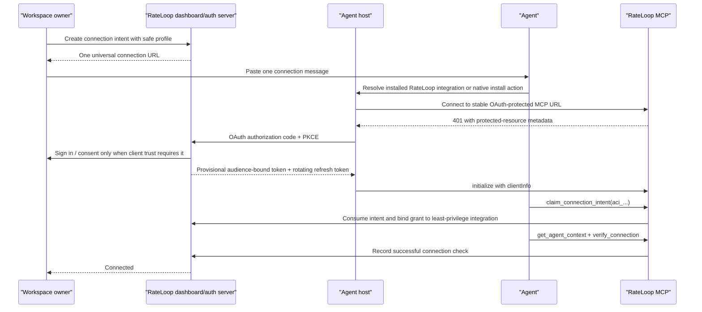
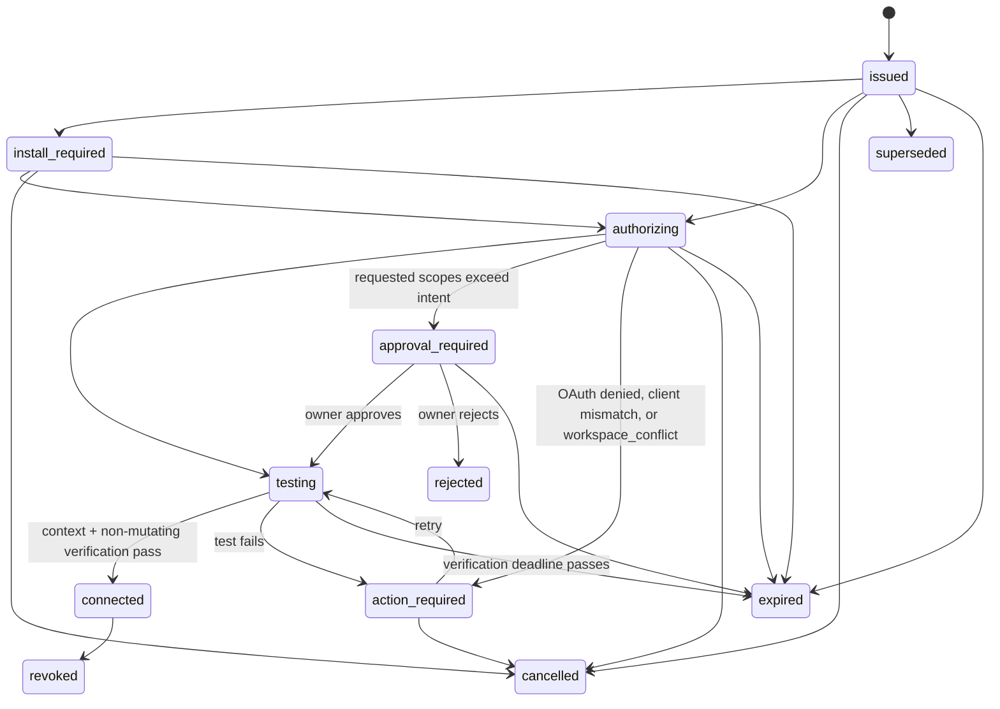

# One-message agent connection plan

- **Status:** Accepted
- **Date:** 2026-07-15
- **Scope:** Tokenless agent connection, MCP authorization, host installation, owner consent, and connection-state UX
- **Design relationship:** This is the accepted corrective follow-up to
  [`tokenless-agent-self-registration-research-2026-07-14.md`](tokenless-agent-self-registration-research-2026-07-14.md).
  It does not change the fund-core design. Its connection and authorization decisions are folded into
  [`tokenless-immutable-implementation-plan-2026-07.md`](tokenless-immutable-implementation-plan-2026-07.md) and are the
  design of record for workspace-agent connection work.

## 1. Decision

Replace the current flow:

> paste a bearer credential into an agent chat -> ask the model to mutate host settings -> restart the host -> poll in
> chat -> approve -> refresh tools

with:

> install RateLoop once -> share one connection link -> authorize in the host/browser -> activate a least-privilege
> integration -> run automatic non-mutating connection verification

The copied message must contain a **connection intent**, not an MCP bearer credential. The host must receive access and
refresh tokens through OAuth or the OAuth device flow, outside the model transcript. A task heartbeat, chat polling loop,
environment-variable edit, or application restart must not be part of the normal RateLoop journey.

**One copy and one paste is an end-to-end invariant, not just button copy.** It applies to both an already-installed host
and a first installation. Install, trust, OAuth, application reload, and host-required new-task transitions must preserve
and resume the original intent automatically. They must never instruct the owner to copy or paste the connection message
again. The owner may still need to complete a host-native install/trust action or RateLoop OAuth consent because RateLoop
cannot bypass those security controls.

The recommended default is **one-message activation** for a safe connection profile:

- clicking the default copy action pre-authorizes a fixed safe profile; there is no required profile or host form;
- the profile permits policy discovery and review-decision calls only;
- it permits no publishing, spending, private-artifact access, or workspace administration;
- the integration activates automatically when an eligible client claims the intent and requests no more than the
  pre-authorized scopes;
- publishing, spending, private artifacts, or broader workflows always require a later step-up authorization.

This preserves meaningful owner consent without requiring the owner to approve the same connection twice.

## 2. What failed in the current interaction

The screenshot and the real Codex attempt expose a product-boundary failure, not just unclear copy.

| Current behavior                                                                                                                | Code path                                                   | Consequence                                                                                                                                                                  |
| ------------------------------------------------------------------------------------------------------------------------------- | ----------------------------------------------------------- | ---------------------------------------------------------------------------------------------------------------------------------------------------------------------------- |
| The copied setup message embeds the raw bearer credential.                                                                      | `components/tokenless/agents/agentConnectionMessage.ts`     | A durable-secret candidate enters the model transcript and cannot be moved into host secret storage safely by every agent.                                                   |
| The same credential starts as the ten-minute pairing credential and is promoted to the 90-day workspace API key after approval. | `lib/tokenless/agentIntegrations.ts`                        | The setup secret must be persisted before it is known whether registration will succeed; rotation repeats the same setup problem.                                            |
| The model is told to modify MCP settings, restart, keep checking status, and refresh tools.                                     | `agentConnectionMessage.ts`, `lib/mcp/workspaceProtocol.ts` | These are host operations, not capabilities RateLoop can assume an agent model has. Codex could add the URL but could not transfer the chat secret into secure host storage. |
| Registration and active integrations expose different tool lists.                                                               | `lib/mcp/workspaceProtocol.ts`                              | Clients that do not hot-refresh dynamic tools require a reconnect or restart exactly when the flow should finish.                                                            |
| The page polls every three seconds while any row is stored as `open` or `claimed`.                                              | `components/tokenless/agents/AgentConnectionPanel.tsx`      | The UI says “Listening for agent…” indefinitely and encourages agent-side polling workarounds.                                                                               |
| Listing connections does not mark elapsed open rows as expired.                                                                 | `lib/tokenless/agentIntegrations.ts`                        | The screenshot shows an expired row from the previous day under “Pending connections.”                                                                                       |
| The main CTA does not ask which host is being connected or show host-specific recovery.                                         | `AgentConnectionPanel.tsx`                                  | The owner cannot tell whether the next step is install, authorize, approve, restart, retry, or abandon.                                                                      |
| Approval requires a publishing policy even when the owner only wants a review-decision connection.                              | `AgentConnectionPanel.tsx`, `agentIntegrations.ts`          | Connection is coupled to a higher-risk capability that should be optional step-up authorization.                                                                             |
| OAuth was researched but not implemented.                                                                                       | `tokenless-agent-self-registration-research-2026-07-14.md`  | The fallback pairing mechanism became the primary flow even for interactive clients that already support OAuth.                                                              |

The continuous Codex heartbeat created during the failed attempt was a workaround for missing product state. It was
annoying because it made a model task responsible for connection lifecycle. The replacement design explicitly prohibits
that dependency.

## 3. Product principles

1. **Install once, authorize each workspace separately.** Host installation and workspace authorization are different
   events. Each operational grant remains bound to one workspace integration.
2. **No operational secret in chat.** Prompts may carry a single-use connection intent, never an access token, refresh
   token, API key, or reusable authorization header.
3. **Use host-native authorization.** Prefer OAuth 2.1 authorization code with PKCE; use OAuth device authorization for
   headless clients.
4. **The server derives authority.** Workspace, integration, agent version, review policy, publishing policy, and scopes
   come from the authenticated grant, never caller-supplied IDs.
5. **Connection does not imply publishing.** The basic integration has no payment, spending, publishing, or private-data
   scopes.
6. **Stable tools beat refresh choreography.** Keep one authenticated tool surface across pending, active, and step-up
   states. Enforce authorization at call time.
7. **Models describe; hosts identify.** `initialize.clientInfo`, OAuth client identity, and installation metadata are more
   reliable than asking a model to invent a stable external ID. Provider/model fields remain declared or unknown unless
   attested.
8. **Push product state, not model work.** The dashboard uses server events or bounded page polling. OAuth clients poll
   token endpoints internally when the protocol requires it. No chat heartbeat is created.
9. **Success means usable.** Show Connected only after authentication, bound-context resolution, and non-mutating
   `rateloop_verify_connection` all succeed.
10. **Fallbacks must be honest.** RateLoop cannot silently bypass a host's install, trust, admin, or OAuth-consent controls.

## 4. Target owner experience

### 4.1 First connection

The primary action is **Copy connection message**. It has no preceding host chooser, connection-profile form, policy
selector, or technical configuration. Clicking it atomically creates an intent with the recommended safe profile and
copies one message. A secondary, collapsed **Customize access** action may create a deliberately elevated intent, but it
must never obstruct or be confused with the default path.

The default surface describes the safe profile in plain language:

> Can check when human review is needed. Cannot spend, publish, read private files, or administer this workspace.

RateLoop learns the host and client version from OAuth and `initialize.clientInfo` after the claim; the owner does not
select or guess them. The copied message is concise but operational:

```text
Use RateLoop to connect yourself to my workspace and finish automatically. Only interrupt me for a host-native install,
trust, or authorization prompt: https://rateloop-tokenless.vercel.app/connect/aci_display...#claim=acn_...
```

The path contains only a display-safe intent ID. The high-entropy claim nonce is carried in the URL fragment so browsers
do not send it in the HTTP request target, referrer, CDN logs, or server access logs. The complete URL is a **sensitive,
short-lived activation capability** and must be shared only with the intended agent. It is not a reusable MCP bearer or
operational credential and cannot directly read workspace data; after the required client trust and OAuth checks, it can
activate the pre-authorized safe profile exactly once.

An unauthenticated `GET /connect/<display-safe-intent-id>` is non-consuming and returns a deterministic handoff: the
canonical MCP resource, claim action, current non-secret status, supported install/deep links, and generic/device
recovery. It serves a human page to browsers and a versioned machine-readable representation to agents. The installed
adapter or browser-side install bridge extracts the fragment locally and carries it through the resume handoff without
placing it in a query parameter, referrer, telemetry field, or log. Merely opening or previewing the path never consumes
the intent.

Client-specific actions remain available as recovery options, not steps before copying:

- **Add to Codex** / install the RateLoop plugin;
- **Add to Cursor** using Cursor's MCP install link;
- **Add to VS Code** using an MCP manifest/gallery or `--add-mcp` action;
- **Copy Claude command** or install the RateLoop Claude plugin;
- **Use device flow** for CLI/headless clients.

### 4.2 Returning supported host

When RateLoop is already installed, the agent resolves the connection URL through the installed integration. The host
starts OAuth when it does not already have a provisional RateLoop grant and receives credentials in its own credential
store. The agent then calls `rateloop_claim_connection_intent` with the intent from the pasted URL. If the intent uses the
safe profile, the server binds that provisional grant to the new workspace integration atomically. Claim is idempotent:
retries by the same OAuth token family and client return the same integration and next action; a different claimant is
rejected. In v1, one OAuth token family binds exactly one workspace integration. Attempting to use an already-bound token
family for any second intent returns stable `workspace_conflict` and an authorization URL for a separate grant; it never
switches the existing grant's workspace. A timeout or reconnect must not force a new message.

The agent then calls:

1. `rateloop_claim_connection_intent`;
2. `rateloop_get_agent_context`;
3. non-mutating `rateloop_verify_connection`.

`rateloop_verify_connection` validates authentication, the workspace/integration binding, context and policy resolution,
and every operation authorized by the safe profile. It creates no review opportunity, assurance record, content, quote,
ask, payment, or publishing event and never calls `rateloop_evaluate_review_requirement`. Transport access logs and the
connection orchestrator's state transition may be recorded separately. The owner and agent see **Connected with safe
access** without a second dashboard approval.

### 4.3 First-time or host-restricted client

One-message does not mean zero host consent. A host may require an install, trust, organization-policy, or OAuth prompt.
The universal link should resolve to the shortest native action for that client and keep the connection intent across the
redirect.

RateLoop and the agent must never claim to bypass, pre-click, or silently accept a first-time host-native installation or
trust decision. When the host requires that action, the agent surfaces exactly one native action, waits, and resumes the
preserved intent after the owner completes it.

The worst supported interactive-client fallback should be:

1. click **Install RateLoop**;
2. approve the host trust prompt;
3. approve the RateLoop browser consent screen;
4. return to the agent, already connected.

There must be no bearer copy, environment variable, config-file secret, or second paste in that fallback. If the host
requires an application reload or new task after installation, the install/OAuth callback persists the intent in
server-owned handoff state and launches or pre-fills the resumed task. The owner does not reconstruct the request.

### 4.4 Headless service

The RateLoop CLI/SDK starts OAuth Device Authorization:

1. the client receives a private `device_code` and a public `user_code` plus verification URL;
2. the client keeps `device_code` outside model-visible output;
3. the owner opens the verification URL and approves the preselected workspace/profile;
4. the client polls the token endpoint internally;
5. short-lived access and rotating refresh tokens are stored in the service's secret manager or encrypted local store;
6. the same non-mutating connection verification marks the integration ready.

The client opens the verification URL itself when the host permits it. Otherwise, displaying that one native security
action is the only interruption. Approval returns to the same device session and the agent resumes without another
message. The final readiness check is `rateloop_verify_connection`, not a synthetic review decision.

This is the standards-based replacement for pasting an API key into a headless agent prompt.

## 5. Target flow



Connection state should be server-owned:



All retries and transitions use stable diagnostic codes. `cancelled` is a server-owned audited transition;
dashboard-only dismissal merely hides a history row. A repeated default copy action may supersede an unclaimed intent
only after the UI explains what will happen; it never creates indistinguishable active rows.

## 6. Authorization design

### 6.1 Standard MCP OAuth discovery

Implement the current MCP authorization requirements on the workspace endpoint:

- return `401 Unauthorized` with `WWW-Authenticate: Bearer resource_metadata="..."` and least-privilege scope guidance;
- serve RFC 9728 protected-resource metadata for the canonical MCP resource;
- serve OAuth authorization-server metadata or OIDC discovery;
- support authorization code with PKCE and exact redirect validation;
- include the MCP resource identifier in authorization and token requests and validate token audience;
- support Client ID Metadata Documents first, pre-registered clients where RateLoop has a marketplace relationship, and
  Dynamic Client Registration only as a compatibility fallback;
- issue short-lived access tokens and rotating, revocable refresh tokens;
- store opaque token hashes or signed-token identifiers, never recoverable bearer values;
- make the existing RateLoop browser session the owner-authentication input to consent, not the MCP credential itself.

### 6.2 Device authorization

Add RFC 8628 device authorization for the RateLoop CLI, CI runners, remote agents, and custom services that cannot receive
a browser callback. The token endpoint performs the protocol polling; the model does not.

### 6.3 Connection intents

Add `tokenless_agent_connection_intents` rather than extending the bearer-pairing semantics:

- display-safe `intent_id`, `workspace_id`, `created_by`, `created_at`, `expires_at`, `consumed_at`;
- hash of the fragment-only claim nonce and a display-safe nonce prefix; never persist or log the recoverable nonce;
- state from the state machine above plus last transition reason;
- selected connection profile and immutable profile version;
- maximum scopes, allowed workflow keys, audience/review preset, and `auto_activate`;
- allowed or preferred host families when the owner selected one;
- claimed OAuth client ID, `initialize.clientInfo`, capabilities, and optional installation attestation;
- claimant token-family/client binding, claim idempotency key, resume-handoff state, and separate authorization/testing
  deadlines;
- generated agent/integration/version IDs after activation;
- no access token, refresh token, API key, or reusable authorization header.

The claim tool accepts the display-safe intent ID and fragment nonce separately. Request/log redaction treats the nonce
as sensitive activation material even though it is not an operational bearer token. The browser install bridge may
exchange it for an opaque, same-client resume handle, but cannot put the nonce into URL queries, cookies readable by
unrelated origins, analytics, crash reports, or support diagnostics.

The safe profile may auto-activate because the owner approved its exact maximum authority before issuing the intent. If
the client asks for additional workflows or scopes, the server moves to `approval_required`; it does not silently widen
the grant.

The initial claim-start window is 30 minutes. When the same verified client begins OAuth before that deadline,
authorization and verification may continue for up to 15 additional minutes, with a hard cap of 45 minutes from issue.
Testing has its own two-minute deadline. Retries from the bound token family do not consume a second use or shorten these
deadlines. These limits replace the current ten-minute bearer constraint without creating an indefinitely reusable link.
If an untouched intent expires, it cannot be revived; a claimed in-progress handoff may be resumed by the same bound
client without another paste while its continuation deadline remains valid.

### 6.4 Client trust and auto-activation

The connection link pre-authorizes safe scopes, not an arbitrary OAuth client. Clients are handled in explicit tiers:

- **verified RateLoop integrations and pre-registered host clients** may auto-activate the safe profile after PKCE,
  audience validation, exact redirect validation, and a matching intent claim;
- **recognized but not pre-registered clients** require the one host/browser OAuth consent showing client identity and
  the safe scope summary;
- **generic CIMD/DCR clients** require explicit OAuth consent and may never silently auto-activate merely because they
  possess the URL;
- elevated scopes always require a separate step-up consent regardless of client tier.

Host family is discovered from verified OAuth/client metadata. Choosing a preferred host while customizing an intent may
narrow eligibility, but the default connection flow never requires a host selector.

### 6.5 Integration credentials

Keep the invariant that an operational principal binds exactly one workspace integration, agent version, and policy
version. Replace the current pairing-token promotion with a separate OAuth grant reference on
`tokenless_agent_integrations`:

- `connection_intent_id`;
- authorization grant/token-family reference;
- OAuth client and subject references;
- granted scopes and step-up history;
- activation mode (`preauthorized_safe`, `owner_approved`, `legacy_pairing`);
- token expiry/rotation/revocation timestamps;
- last successful initialize/context/decision/request/result timestamps;
- stable diagnostic code and recovery action.

In v1, the authorization grant/token-family reference is unique across active integrations. One token family can bind to
one workspace integration only. Replaying the same intent for that binding is idempotent; claiming a different intent or
workspace with the bound family returns `workspace_conflict` and requires a separate OAuth grant/token family. Caller
supplied workspace IDs never switch or widen the binding.

Before an intent is claimed, the OAuth grant has only `connection:claim` and can read no workspace resources. Claiming a
safe intent atomically converts the grant to an integration-bound grant; authorization checks derive the new authority
from the server-side token-family binding. It is not necessary to expose or replace the token in the model transcript.

Publishing and spending remain separate, versioned step-up grants. A basic connection must not require a publishing
policy.

## 7. MCP contract changes

### 7.1 Stable authenticated tool list

Do not switch from a two-tool registration surface to a six-tool active surface. Expose one stable list after OAuth:

- `rateloop_claim_connection_intent`;
- `rateloop_get_agent_context`;
- `rateloop_verify_connection`;
- `rateloop_get_assurance_state`;
- `rateloop_evaluate_review_requirement`;
- `rateloop_request_review`;
- `rateloop_wait_for_review`;
- `rateloop_get_review_result`;
- optional `rateloop_request_scope_upgrade` for an explicit browser step-up.

Before activation, only intent claim and connection-context behavior are authorized; active operations fail with a
structured `connection_not_ready` response and recovery URL. After binding, the same token family resolves the exact
integration and the already-listed active tools become usable. Tool-list change notifications can improve capable
clients, but no correctness path may depend on a client refreshing tools.

`rateloop_verify_connection` is an application-domain read. It verifies the active principal, bound workspace,
integration/version/policy provenance, and safe-profile authorization without creating or evaluating a review, reserving
a budget, or writing an assurance artifact. `rateloop_request_scope_upgrade` returns one browser authorization URL; after
consent, the agent observes the grant transition and automatically resumes the interrupted tool call. It must not ask the
owner to return to the dashboard, re-paste the intent, or manually repeat the task.

### 7.2 Remove model-owned registration choreography

Delete the normal-path requirements to:

- infer a stable `externalId`;
- call `rateloop_register_agent` exactly once;
- poll `rateloop_get_registration_status` in the chat;
- refresh tools after approval;
- copy or persist the connection credential.

Derive a stable installation identity from the OAuth client, token subject, RateLoop connection intent, and host-provided
client metadata. Let the server create the RateLoop agent/version IDs. Provider, model, deployment, and version remain
optional declared metadata and default to `unknown` when the host does not attest them.

## 8. Host strategy

| Host                           | Preferred RateLoop path                                                                                                                | First-use fallback                                                                                                                  | Returning-user target                                                                           |
| ------------------------------ | -------------------------------------------------------------------------------------------------------------------------------------- | ----------------------------------------------------------------------------------------------------------------------------------- | ----------------------------------------------------------------------------------------------- |
| Codex app/CLI/IDE              | Published RateLoop plugin bundling the existing public MCP plus a separate stable OAuth-protected workspace MCP and connection skill   | Install/enable plugin and authenticate in the native MCP UI; a required reload/new task receives the persisted intent automatically | Paste one connection link; native OAuth opens if the stored provisional grant cannot satisfy it |
| Claude Code                    | RateLoop Claude plugin with the public and workspace HTTP MCP entries, or one `claude mcp add --transport http` workspace installation | `/mcp` browser OAuth and trust                                                                                                      | Paste one connection link; no manual secret; use `list_changed` only as an optimization         |
| Cursor                         | Official **Add to Cursor** MCP install link plus OAuth                                                                                 | One-click install and native OAuth                                                                                                  | Paste one connection link; credentials remain in Cursor's auth storage                          |
| VS Code / Copilot              | MCP gallery/manifest or user-profile install, with OAuth client metadata                                                               | Trust prompt plus browser OAuth; `code --add-mcp` as a CLI option                                                                   | Paste one connection link; autostart/authorization handles the server                           |
| Generic interactive MCP client | Canonical URL plus standard protected-resource discovery, PKCE, CIMD/DCR                                                               | One config entry containing only the URL                                                                                            | Paste one connection link and authorize in browser                                              |
| Headless agent / SDK / CI      | `rateloop connect` device flow or SDK helper                                                                                           | Verification URL + user code                                                                                                        | Refresh-token renewal in secret storage; no model-visible credential                            |
| No MCP support                 | OAuth-backed RateLoop SDK/API                                                                                                          | Install SDK/helper and run device flow                                                                                              | Same integration principal and policy contract as MCP                                           |

The universal URL should perform host-aware routing, but RateLoop must not depend on unreliable user-agent detection. It
always offers every supported install action and a generic standards-based option.

For every host, install/deep-link state and the connection intent are separate values. The host adapter or server-owned
resume handoff carries the intent through installation, reload, OAuth callback, and any required new task. A recovery
screen may offer one native **Resume connection** action, but never another copy/paste instruction.

## 9. Dashboard redesign

### 9.1 Replace infrastructure copy with outcome copy

Use:

- **Waiting for the agent to open your link**
- **RateLoop needs permission in Codex**
- **Authorization completed; testing the connection**
- **Connected with safe access**
- **Action required: RateLoop is installed but disabled**
- **Link expired — create a new one**

Remove **Listening for agent…** unless the page is actively receiving a server event and can name what it is waiting
for.

### 9.2 Make every non-terminal state actionable

Each card should show:

- host and client version when known;
- current state and last transition time;
- one primary action (`Open install`, `Authorize`, `Review scope request`, `Retry test`, `Create new link`);
- a short diagnostic suitable for support, without secrets;
- cancel/dismiss for unused intents.

The copy action itself owns the happy-path interaction. It creates and copies the intent in one click, changes to
**Copied**, moves focus to a concise progress card, and offers a selectable full-message fallback when clipboard access is
denied. Connection continues with the dashboard and original chat closed. The agent sends one final confirmation and
interrupts only for an unavoidable host-native install/trust/OAuth action or later elevated-scope consent.

### 9.3 Expire stale state correctly

Before returning connection state, atomically mark elapsed `issued`, `install_required`, or `authorizing` intents as
`expired`. Do the same for legacy `open` and `claimed` pairing rows during migration. The UI must also defensively treat
`expiresAt <= now` as expired and stop polling.

Keep expired/rejected intents in collapsed **Connection history**, not **Pending connections**. Retention should follow the
workspace audit policy.

### 9.4 Push dashboard state

Prefer a workspace-authenticated Server-Sent Events route for connection transitions. Fall back to page polling only
while the page is visible, the intent is non-terminal, and the deadline is in the future. Back off from 2 to 10 seconds;
do not poll permanently.

This page transport is separate from MCP Streamable HTTP and must not contain token material.

### 9.5 Accessibility and resilient recovery

- State transitions use a dedicated `aria-live="polite"` region and never replace or move keyboard focus during background
  refresh. Newly created or action-required cards receive programmatic focus only as the direct result of the user's
  action.
- Every status has text and an icon in addition to color. Deadlines show a relative countdown and an exact localized
  timestamp. Motion respects `prefers-reduced-motion`.
- Install, authorize, resume, retry, cancel, and dismiss controls are keyboard reachable and have purpose-specific
  accessible names. Destructive confirmation uses an accessible dialog, not `window.confirm`.
- Clipboard denial reveals a labeled, read-only, selectable copy of the complete message. Copy success is announced next
  to the initiating control rather than at the bottom of the page.
- SSE or polling updates preserve card order and focus. Screen readers announce meaningful state changes once, not every
  poll. Hidden tabs stop polling without stopping the server-owned connection.
- Mobile, zoom, high-contrast, browser-back, expired-link, denied-consent, and install-reload recovery are required UX
  test cases.

## 10. Migration and implementation sequence

Keep each concern in a separate commit.

### Phase 0 — accept the new boundary

1. **`docs(agents): accept OAuth connection-intent design`**
   - Amend the design of record.
   - Define the safe auto-activation profile, client trust tiers, and step-up scope boundary.
   - Freeze the one-copy/one-paste, no-secret-in-chat, non-mutating verification, and stable-tool-list requirements.

### Phase 1 — immediate product repair

2. **`fix(agents): expire stale connection rows`**
   - Mark elapsed open/claimed pairings expired on read or in a transaction-safe cleanup.
   - Stop page polling after expiry.
   - Move expired entries to history and add create-new-link/cancel actions.
3. **`fix(agents): replace indefinite connection status copy`**
   - Remove the generic listener badge.
   - Show exact stage, deadline, and recovery action.
   - Remove any recommendation to create chat heartbeats.

These fixes do not make the bearer flow acceptable; they only stop the current UI from lying while the replacement is
built.

### Phase 2 — authorization foundation

4. **`feat(db): add connection intents and OAuth grant bindings`**
   - Add forward-only intent, token-family, scope-upgrade, and event data.
   - Extend integration provenance without changing legacy rows in place.
5. **`feat(auth): add MCP OAuth discovery and PKCE`**
   - Protected-resource metadata, authorization metadata, CIMD, DCR fallback, PKCE, audience validation, rotation,
     revocation, and consent.
6. **`feat(auth): add device authorization for agents`**
   - Device endpoint, verification page, bounded polling, CLI/SDK storage adapters, and abuse controls.
7. **`feat(policy): decouple connection from publishing`**
   - Make the safe connection profile valid without a publishing policy.
   - Add explicit browser step-up for human-review creation, private artifacts, budgets, and publishing.
   - Complete this schema/service boundary before the universal UI can create safe integrations.

### Phase 3 — integration and product flow

8. **`refactor(mcp): use one stable authenticated tool surface`**
   - Remove registration-only tool switching from the new path.
   - Derive all authority from the grant/integration.
   - Add structured step-up and connection-not-ready results plus non-mutating `rateloop_verify_connection`.
9. **`feat(agents-ui): add universal connection intents`**
   - One-click safe message, optional advanced access, progress cards, resume handoff, SSE, accessible recovery, connection
     verification, and history.
10. **`feat(agents): add host installers and device connect`**
    - Codex and Claude plugins, Cursor install link, VS Code manifest/gallery metadata, generic JSON, CLI, and SDK helper.
    - Persist the same intent through install, OAuth callback, reload, and a host-required new task.

### Phase 4 — cutover

11. **`test(e2e): verify the cross-host connection matrix`**
    - Test first and returning installs with exactly one copy/paste, same-client claim retry, different-client rejection,
      install/reload/new-task resume, clipboard denial, hidden dashboard, expired intent, denied consent, scope upgrade,
      revocation, offline recovery, multiple workspaces, accessibility, and enterprise-disabled MCP.
12. **`refactor(agents): retire bearer pairing promotion`**
    - Stop issuing new bearer pairings.
    - Keep existing integrations valid until expiry or rotation.
    - Rotation moves legacy integrations onto OAuth/device authorization.
    - Delete the bearer-in-message builder only after the live cutover is verified.

## 11. Acceptance criteria

The redesign is complete only when:

- the copied connection message contains no `rlk_` credential or authorization header;
- the connection path contains only a display-safe intent ID; the sensitive claim nonce remains in the URL fragment and
  is absent from HTTP request targets, referrers, server/CDN logs, analytics, and diagnostics;
- both a returning host and a first-time supported host use exactly one generated message, one clipboard copy, and one
  paste for an attempt started before the intent deadline;
- install, trust, OAuth, reload, callback, retry, and host-required new-task transitions preserve and resume that original
  intent without another copy, paste, dashboard visit, or task instruction;
- beyond the initial copy/paste, the owner is interrupted only for an unavoidable host-native install/trust action, OAuth
  consent required by the client trust tier, or a later elevated-scope consent;
- a first-time host-required install/trust decision is always shown as a native owner action and is never represented as
  something RateLoop or the agent can bypass or accept silently;
- Codex, Claude Code, Cursor, VS Code/Copilot, a generic MCP client, and the RateLoop headless helper each pass an E2E;
- no path requires a task heartbeat, model-owned polling loop, manual token storage, or tool-list refresh for correctness;
- connection completes while the dashboard and originating chat are closed; SSE/polling is presentation only;
- repeated claims from the same OAuth token family/client are idempotent, while a different claimant cannot consume or
  resume the intent;
- one OAuth token family binds exactly one workspace integration in v1; a second intent or workspace returns
  `workspace_conflict` and starts a separate authorization instead of switching the existing binding;
- expired connection attempts leave Pending immediately and offer a single recovery action;
- `initialize.clientInfo` and OAuth provenance are stored, while provider/model fields are visibly declared or unknown;
- the safe profile auto-activates with no publishing, payment, private-artifact, or administration scopes;
- verified/pre-registered clients follow the safe auto-activation path, while unknown/generic clients require explicit
  OAuth consent showing their identity and requested safe scopes;
- elevated scopes always require an explicit step-up consent screen with exact workspace, workflows, policy, and budget;
- the operational credential remains bound to one workspace integration, immutable agent version, and policy version;
- revocation blocks the next MCP/API request and invalidates the token family;
- tokens are audience-bound, short-lived, rotated, hash-only or signed-ID-only at rest, and absent from URLs and logs;
- the dashboard shows **Connected with safe access** only after context resolution and non-mutating
  `rateloop_verify_connection` succeed;
- verification creates no review opportunity, assurance record, quote, ask, payment, publishing event, or workspace
  artifact and never calls `rateloop_evaluate_review_requirement`;
- keyboard-only, screen-reader, reduced-motion, mobile, zoom, high-contrast, clipboard-denied, and focus-preserving
  background-update checks pass;
- the public four-tool handoff MCP remains isolated and unchanged until a separately accepted unification design exists.

## 12. Success metrics

Track by client family and version:

- median and p95 time from intent creation to Connected;
- install-required, OAuth-started, consented, test-passed, and abandoned conversion;
- top structured failure/recovery codes;
- retries and duplicate intents per successful integration;
- percentage of both first-time and returning-host connections completed from exactly one copy/paste;
- user actions after the paste, separated into unavoidable install/trust, OAuth consent, and unexpected intervention;
- number of secrets detected in generated connection messages or telemetry: target **zero**;
- stale Pending rows older than their expiry: target **zero**.

Targets after rollout:

- returning installed client: median under 30 seconds;
- first-time supported client: median under 90 seconds;
- no more than one user trust/install action and one OAuth consent action;
- zero product-caused requests to copy or paste the connection message again after installation, reload, retry, or OAuth;
- over 95% of successful connections require no dashboard refresh or support intervention.

## 13. Risks and explicit limits

- **Universal zero-click installation is impossible.** Hosts and enterprise administrators may require trust or may block
  MCP entirely. The promise should be one message plus native consent, not silent installation.
- **Connection-link leakage:** treat the complete link as a sensitive activation capability. Keep only the display-safe
  intent ID in the path and the nonce in the fragment; make intents single-use, short-lived, nonce-hashed, profile-bounded,
  and revocable. The safe profile limits the damage of an unintended claim. Show the claimed host before granting elevated
  scopes.
- **Install or OAuth outlives the initial deadline:** use the bounded 30-minute claim-start window and the same-client
  continuation deadline above. Persist resume state before a host reload. Never solve a product-caused timeout by asking
  the owner to paste the same message twice.
- **Claim response is lost:** make a repeat claim from the same token family/client return the original successful binding;
  never interpret a transport retry as a different agent registration.
- **OAuth client impersonation:** use exact redirect validation, PKCE, state, CIMD validation, SSRF defenses, and
  pre-registration for marketplace clients where possible.
- **Multiple workspaces:** keep each OAuth token family bound to one integration. Hosts that support multiple accounts may
  store multiple RateLoop grants/token families; otherwise return `workspace_conflict` and present an explicit separate
  authorization rather than accepting a caller workspace ID or switching the existing grant.
- **Client capability drift:** keep the generic OAuth/device path authoritative and treat vendor install links as adapters.
- **Dynamic tools:** retain `list_changed` support as an optimization, but keep the stable tool surface as the compatibility
  baseline.

## 14. Sources

- [MCP authorization specification, 2025-11-25](https://modelcontextprotocol.io/specification/2025-11-25/basic/authorization)
- [OAuth 2.0 Device Authorization Grant, RFC 8628](https://www.rfc-editor.org/rfc/rfc8628.html)
- [OAuth 2.0 Security Best Current Practice, RFC 9700](https://www.rfc-editor.org/rfc/rfc9700.html)
- [Codex MCP configuration](https://learn.chatgpt.com/docs/extend/mcp)
- [Claude Code MCP configuration and OAuth](https://code.claude.com/docs/en/mcp)
- [Cursor MCP and one-click installation](https://docs.cursor.com/context/model-context-protocol)
- [VS Code MCP server management](https://code.visualstudio.com/docs/agent-customization/mcp-servers)
- [VS Code MCP configuration and OAuth](https://code.visualstudio.com/docs/agents/reference/mcp-configuration)

## 15. Accepted next action

The boundary in Section 1 is accepted. Implement the dependency-ordered sequence in Section 10, beginning with the
immediate stale-state repair and then the OAuth/intent foundation. Do not spend more time refining the bearer pairing
prompt; its failure is evidence that prompt instructions cannot substitute for host-native authorization.
