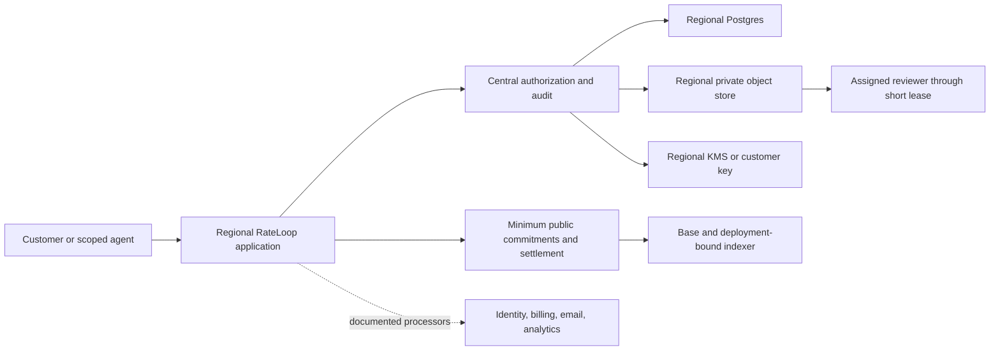

# RateLoop Tokenless Privacy, Security, and Compliance Claim-Readiness Plan

**Date:** 15 July 2026

**Branch:** `tokenless`

**Status:** implementation plan and claim gate, not a certification or legal opinion
**Design relationship:** this plan extends the
[tokenless implementation plan](tokenless-immutable-implementation-plan-2026-07.md). It does not reopen the immutable
fund-core, admission, settlement, or deployment-isolation decisions in that design of record.

## Executive decision

Privacy and enterprise security should become a first-class RateLoop product pillar. The immediate opportunity is not
to copy Humanloop's badges. It is to make a smaller set of valuable claims provable:

1. private customer content is not used to train AI models;
2. private evaluation data is encrypted, access-controlled, logged, retained, and deleted under an explicit policy;
3. customers can manage people and agents through real role- and project-scoped access;
4. a DPA, subprocessor list, transfer terms, and data-subject workflow support enterprise GDPR reviews;
5. US and EU data planes have documented, testable boundaries; and
6. independent security testing and, later, a SOC 2 Type II report substantiate the operating program.

RateLoop should **not** claim SOC 2 Type II, GDPR compliance, HIPAA support, customer-VPC deployment, EU-only data
residency, SAML SSO, or third-party penetration testing today. Each requires evidence that does not yet exist.

The recommended order is:

1. **No-training contract and privacy operations**
2. **Complete encryption, centralized authorization, audit, deletion, and key management**
3. **Enterprise RBAC, SAML/OIDC, SCIM, MFA policy, and regional data planes**
4. **Independent penetration test and public trust center**
5. **SOC 2 Type II**
6. **Customer VPC/BYOC and HIPAA only after contracted design-partner demand**

This order can unlock useful homepage language within weeks without making claims that depend on a multi-month audit.

## 1. What Humanloop's claims actually mean

[Humanloop's homepage](https://humanloop.com/home) currently lists VPC deployment, EU or US hosting, no training on
customer data, RBAC, custom SSO/SAML, third-party penetration testing, SOC 2 Type II, GDPR, and HIPAA via BAA. Its
[compliance page](https://humanloop.com/platform/compliance-security) adds self-hosting, TLS/SSL in transit, AES-256 at
rest, export, and a trust center.

These are different types of promises and need different release gates:

| Claim type | Example | What makes it true |
|---|---|---|
| Product behavior | No training on customer data | Code path, data-use policy, terms/DPA, vendor contracts, telemetry review, and tests |
| Product capability | RBAC, SSO/SAML, export | Implemented admin UX and APIs, authorization tests, tenant-isolation tests, and operating documentation |
| Deployment architecture | EU/US hosted, VPC/BYOC | Region-pinned compute, databases, object storage, logs, backups, keys, and processor contracts |
| Independent assurance | Penetration tested | A scoped external test, remediation, retest, and a dated attestation/report |
| Audit report | SOC 2 Type II | An independent CPA report covering controls that operated throughout a defined period |
| Legal program | GDPR | Controller/processor analysis, lawful bases, notices, DPAs, records, rights handling, security, transfers, and DPIAs |
| Regulated service mode | HIPAA via BAA | HIPAA applicability analysis, risk analysis, safeguards, BAAs throughout the vendor chain, and a constrained PHI-capable product mode |

A vendor logo or a compliant infrastructure provider does not transfer the claim to RateLoop. The claim has to cover
RateLoop's application, people, processes, vendors, and actual system boundary.

### Better patterns in the current market

[Braintrust](https://www.braintrust.dev/docs/security) and [Langfuse](https://langfuse.com/security) show the stronger
pattern to emulate:

- a public trust center or security hub, not an unexplained badge row;
- precise RBAC, API-key, SSO, audit-log, retention, export, and encryption descriptions;
- a clear split between managed SaaS, BYOC/customer data plane, and self-hosted deployment;
- named cloud regions and an explanation of what remains in a global control plane;
- downloadable DPA, subprocessor, penetration-test, and audit evidence; and
- restrained HIPAA language tied to a specific region/mode and a BAA.

RateLoop can differentiate further by pairing this enterprise evidence with its existing honest public-chain data map:
off-chain privacy controls and public settlement evidence are separate promises.

## 2. Current tokenless evidence

### What is already credible

The branch is not starting from zero.

- The active checkout is correctly isolated to the `rateloop-tokenless` Vercel project, and the Railway project is also
  named `rateloop-tokenless`.
- Private artifact bytes are encrypted with AES-256-GCM before private Vercel Blob storage. Each object receives a
  random data key, which is wrapped separately.
- Artifact access supports short reviewer leases, owner/admin export restrictions, access logging, scheduled deletion,
  and tenant-scoped commitments.
- Reviewer rationales, provider evidence, tax records, integrity features, webhook secrets, and nullifier seeds use
  purpose-labelled encryption domains.
- Browser sessions are opaque, stored as hashes, time-limited, HttpOnly, and protected by same-origin checks on
  mutations. The app also sets HSTS, frame denial, content-type, referrer, permissions, and CSP headers.
- Workspace API keys are hash-only and can carry scopes, policies, expiry, spend limits, project limits, data
  classifications, and webhook limits. Approved agent connections are revocable and credential rotation is logged.
- Workspace roles (`owner`, `admin`, `member`, `billing`) and governance/client-role tables exist. Artifact export and
  management already distinguish owner/admin from ordinary members.
- The repo runs dependency audit and Solidity static analysis in CI, uses pinned GitHub Actions, has CODEOWNERS, and
  publishes `SECURITY.md`, `TRUST.md`, a privacy notice, and honest public-chain limits.
- The runtime application does not currently contain an OpenAI, Anthropic, or other model-training/inference dependency
  that receives private customer evaluation content.

These foundations support narrow factual language today, but not broad compliance claims.

### Current deployment reality

Read-only live inspection on 15 July 2026 found:

- Railway Postgres, Ponder, and keeper are each single-instance deployments in Railway US East (Virginia,
  `us-east4-eqdc4a`).
- Postgres uses one attached volume. No repository artifact documents a tested backup restore, RPO, RTO, failover, or
  disaster-recovery exercise.
- The Vercel project is correctly isolated, but no application configuration pins the function region. The Blob store
  region is an external dashboard property and is not asserted by the readiness check.

This is not an EU/US choice. It is a partly documented US deployment whose complete data location and recovery behavior
have not been turned into a customer commitment.

### Material gaps

#### 2.1 Customer data protection is incomplete

Artifact bytes are encrypted, but many customer or reviewer values remain plaintext in Postgres, including project and
case instructions, rubric prompts/JSON, suite and run manifests, question/content/terms JSON, quote and ask request JSON,
result/evidence JSON, qualification provenance, blinding data, reviewer account addresses, notification emails, and
identity profile fields.

The paid-voucher and commit rows also keep a plaintext join from a RateLoop rater identity to public vote keys and
nullifiers. `TRUST.md` correctly calls this a database-level deanonymization risk.

The artifact vault uses one application environment wrapping key and one active key version. It is not a managed KMS,
does not implement customer/tenant keys, and has no demonstrated online rewrap/rotation or recovery ceremony.

#### 2.2 Authorization is coarse and inconsistently consumed

Role rows exist, but there is no complete workspace-member administration product. The workspace-governance service
contains client assignment and invitation logic that has no corresponding account routes or UI.

More importantly, artifact authorization checks ordinary workspace membership, not the client assignment tables. An
ordinary member can therefore access every non-deleted project in that workspace if they know the identifiers. The same
kind of authorization decision is reimplemented across services instead of passing through one policy engine.

This is not yet enterprise RBAC or client/project isolation.

#### 2.3 Identity policy is not enterprise identity

thirdweb email, Google, Apple, passkey, and wallet sign-in provide convenient identity. They do not provide customer
SAML, SCIM, domain ownership, customer-enforced MFA, JIT policy, IdP group mapping, or central session revocation. Email
domain is deliberately not authorization, which is correct.

#### 2.4 Audit coverage is fragmented

RateLoop logs artifact reads, agent policy events, agent registration/integration events, private-group events,
review-policy changes, billing webhooks, and chain transparency events in separate tables. There is no tenant-wide
activity stream covering authentication, membership, role changes, data exports, retention changes, secrets, billing,
and privileged operator access. There is no append-only export, external log sink, configurable retention, alerting, or
customer API for the complete audit trail.

#### 2.5 Retention and data rights are artifact-only

Project deletion schedules Blob deletion and marks artifact objects deleted, but it does not erase or anonymize the
complete relational graph. The app has no data-subject request case workflow, identity verification, export bundle,
rectification path, objection/restriction state, legal-hold implementation, deletion proof, or backup-expiry tracking.

The privacy notice offers an email address but does not specify legal bases, processor/controller roles by workflow,
recipients/subprocessors, international transfer mechanisms, category-specific retention, supervisory-authority rights,
or an operational response process.

#### 2.6 Organizational security is not evidenced

The public vulnerability policy is useful, but the repository contains no operating incident-response plan, severity
matrix, breach-notification procedure, vendor-risk program, access-review procedure, device/endpoint standard,
joiner-mover-leaver process, backup/restore runbook, business-continuity plan, risk register, security-training record,
or control evidence calendar.

The live data stack is single-region and single-instance. Application and service alerting is not centralized. Rate
limiting covers the public MCP, World ID, and public media quotas, not the full authenticated and unauthenticated route
surface.

#### 2.7 Software supply-chain controls are partial

Dependency audit and Slither are present, but the TypeScript/Next.js services do not run CodeQL or equivalent SAST.
Container images are built but not vulnerability-scanned. There is no SBOM/provenance gate, IaC scan, DAST stage,
malicious-secret-pattern scan, or automated dependency-update file.

GitHub currently has secret scanning enabled, but push protection and non-provider pattern scanning are disabled. The
`tokenless` branch is not protected; the repository ruleset prevents destructive ref moves but does not require pull
requests, independent approval, signed commits, or passing checks. A SOC 2 change-management claim cannot rely on the
current settings.

#### 2.8 Contracts and vendor evidence are missing

The repo has client DPA status fields, but not a RateLoop DPA. There is no public subprocessor list, transfer-impact
assessment, records of processing activities, technical and organizational measures schedule, or signed inventory of
vendor DPAs.

Current material vendors include at least Vercel/Blob, Railway/Postgres, thirdweb and its login providers, Stripe,
Resend when enabled, Simple Analytics, Base RPC/infrastructure, drand relays, World ID when enabled, and human reviewers.
Each has a different role and data scope. The homepage claim cannot be broader than the weakest required processor or
the actual reviewer disclosure.

The existing strategy also mentions possible future aggregate ratings-data licensing. That default is incompatible
with a strong private-customer promise. Private customer content and rationales must be excluded from training,
licensing, sale, public benchmarking, and unrelated secondary use unless a customer enters a separate, explicit,
revocable opt-in program.

## 3. Claim-readiness matrix

Use the wording below as the maximum public claim at each gate. Legal review can narrow it further.

| Desired claim | Status on 15 July 2026 | Required release gate | Approved wording after the gate |
|---|---|---|---|
| Private artifacts encrypted | Narrow claim is supported | Keep artifact tests and disclose DB/public-chain limits | **Private artifacts are encrypted before storage; assigned reviewers receive short-lived access leases.** |
| No training on customer data | Runtime fact, not yet a contractual promise | Terms/DPA/privacy update; vendor review; secondary-use prohibition; data-use tests | **RateLoop does not use private customer content to train AI models.** |
| Configurable retention/deletion | Artifact-only | Category retention registry, full relational deletion/restriction, backup expiry, export and deletion evidence | **Set retention for private evaluation data and export or delete it under your workspace policy.** |
| RBAC | Coarse internal roles only | Member/admin UI, project/client scopes, centralized policy engine, tenant matrix tests, audit | **Role-based access controls keep workspace, client, project, billing, and audit duties separate.** |
| Scoped agent access | Substantially implemented | Finish credential admin UX and complete activity log | **Agents use scoped, revocable credentials with project, data, workflow, and spend limits.** |
| SSO/SAML | Not implemented | Enterprise IdP adapter, verified domains, SAML/OIDC, JIT, MFA policy, session revocation, IdP tests | **SAML SSO with customer-managed identity policy is available on Enterprise.** |
| SCIM | Not implemented | Provision/deprovision/groups API, idempotency, reconciliation, audit, removal tests | **SCIM provisioning and deprovisioning are available on Enterprise.** |
| US hosted | Partial and not contract-pinned | Pin every data-plane service/store/key/log/backup; publish data map and exceptions; verify continuously | **Choose a US-hosted RateLoop data plane.** |
| EU hosted | Not implemented | Independent EU stack, regional keys/data, transfer analysis, processor terms, no cross-region application writes | **Choose an EU-hosted RateLoop data plane.** |
| EU-only residency | Not supportable on current evidence | Contractual residency for control plane, support, logs, and backups, or BYOC; document emergency/failover behavior | Do not claim until counsel and architecture approve exact scope |
| VPC deployment | Not implemented | Portable data plane, KMS/object-store adapters, Terraform/Helm, private connectivity, upgrade/backup/support model | **Deploy the RateLoop data plane in your cloud account and region.** |
| Independent pen test | Not performed | External scoped test, fix/retest critical and high findings, dated attestation | **Independently penetration tested — report available under NDA.** |
| SOC 2 Type II | Not audited | Auditor-approved scope, readiness, operating evidence period, completed report | **SOC 2 Type II — report available under NDA.** |
| GDPR | Incomplete program | DPA, ROPA, DPIA, lawful bases, rights workflow, processors/transfers, retention, security, counsel sign-off | Prefer **DPA available; GDPR controls and EU transfer safeguards documented** over a badge |
| HIPAA via BAA | Not available | HIPAA mode, risk analysis, policies, workforce/subcontractor safeguards, upstream BAAs, RateLoop BAA, counsel review | **HIPAA-ready deployment with BAA available** only for the approved mode |

### Claims that should remain prohibited

- `anonymous`, `fully confidential`, or `cross-round unlinkable`;
- `EU data never leaves the EU` while support, backups, auth, email, billing, or chain metadata can leave;
- `GDPR certified` or a GDPR badge suggesting third-party certification;
- `SOC 2 compliant` before the actual report is issued, or after it has expired;
- `HIPAA compliant` for the general product;
- `VPC` when the offer is only a dedicated multi-tenant SaaS project;
- `never shared with third parties`, because assigned human reviewers and documented subprocessors necessarily process
  data; and
- `all data encrypted` while required searchable metadata and public-chain records remain plaintext/public.

## 4. Target privacy and deployment architecture

The primary architectural rule is: **a workspace has one immutable home region, one policy set, and no implicit data
copy to another regional data plane.** Public-chain settlement remains a separately disclosed global/public plane.



### 4.1 Data classes and allowed uses

Add one canonical data classification and use registry shared by browser, API, workers, exports, and audit:

| Class | Examples | Default use | Training/secondary use | Location |
|---|---|---|---|---|
| Public | Customer-approved public question and share artifact | Public panel and publication | Only as explicitly stated at submission | Public/global |
| Synthetic | Test fixtures with no real people/customer IP | Sandbox and product testing | Allowed within declared sandbox terms | Regional or public |
| Internal | Workspace configuration and low-risk metadata | Service delivery | Prohibited | Workspace region |
| Confidential | Prompts, outputs, rubrics, rationales, artifacts | Assigned review and evidence | Prohibited | Encrypted regional data plane |
| Restricted | Identity linkage, eligibility, tax, sanctions, secrets | Narrow statutory/security purpose | Prohibited | Purpose-separated vault/KMS |
| Regulated | PHI or other specially contracted data | Disabled by default | Prohibited | Only approved dedicated mode |

Implement `data_use_classification`, `home_region`, `retention_policy_id`, and `legal_hold_state` as first-class
workspace/project fields. Every ingestion route must reject a classification that its credential, deployment, reviewer
source, or product mode does not permit.

### 4.2 Encryption and key custody

Create one vault abstraction instead of domain-specific ad hoc encryption helpers:

- envelope encryption with a random data key per object/record;
- separate KMS keys for customer content, reviewer rationale, identity linkage, provider evidence, tax records, webhook
  secrets, and audit signing;
- tenant and region in authenticated encryption context;
- versioned key lookup, rotation, rewrap, revocation, recovery, and access audit;
- no application environment variable that is itself the root wrapping key in production;
- optional customer-managed key/BYOK later; and
- cryptographic deletion only where the retention and backup model makes it meaningful.

Encrypt customer-bearing structured records, not only Blob objects. Keep only the minimum indexed metadata in
plaintext. Split the rater-to-vote mapping into a restricted linkage vault with per-rater or per-subject data keys and
hash-only uniqueness indexes.

### 4.3 Central authorization

Introduce one deny-by-default authorization service consumed by all browser routes, agent routes, workers, and artifact
reads. Its decision inputs should include:

- principal and authentication assurance;
- workspace/client/project/object;
- human role and governance duty;
- agent integration, exact version, credential scopes, and publishing policy;
- requested action and data classification;
- region, retention, legal hold, and contract mode; and
- reviewer assignment, confidentiality acceptance, and lease.

Minimum human roles should be `owner`, `security_admin`, `workspace_admin`, `project_admin`, `contributor`, `reviewer`,
`auditor`, and `billing`. Avoid using `billing` as a project role. Custom roles can follow after the permission model is
stable.

Add property-based and table-driven tenant tests: every route/action must prove same-tenant access and at least one
explicit cross-tenant denial. Client/project assignments must be enforced on the data query, not only in UI.

### 4.4 Enterprise identity

Keep public/individual reviewer onboarding separate from enterprise workforce identity.

- Continue thirdweb/passkey/wallet identity for individuals and public reviewers.
- Add a provider-neutral enterprise identity adapter for SAML 2.0 or OIDC.
- Bind a verified IdP subject to a RateLoop principal; do not make a wallet or email domain the authorization source.
- Add verified domain ownership, organization discovery, IdP-enforced login, JIT rules, group-to-role mappings, session
  revocation, and MFA requirements.
- Add SCIM after the permission model is stable; provision/deprovision must be idempotent and auditable.
- Keep funding/payout wallet proof separate from browser/workforce identity exactly as the tokenless design requires.

### 4.5 Regional SaaS

Build US and EU as separate deployable stacks, not a region column over one shared database.

Each stack needs regional:

- application functions;
- Postgres and backups;
- private object storage;
- KMS/secrets;
- queues/cron workers;
- Ponder/keeper operational records;
- logs, metrics, traces, and alert storage; and
- support-access controls.

Provisioning assigns the region once. Cross-region support access, failover, export, and disaster recovery must be
documented rather than hidden. Region parity should be checked from machine-readable deployment manifests during build
and at runtime.

Railway supports US East and EU West deployment regions, and Vercel Blob supports region selection. That makes a
regional data plane feasible on the current vendors. It does **not** by itself prove strict residency: Vercel's current
[DPA](https://vercel.com/legal/dpa) states that primary processing is in the US and its security documentation describes
globally replicated backups. Strict EU residency therefore requires explicit enterprise terms or a different/BYOC data
plane, not optimistic copy.

### 4.6 Customer VPC/BYOC

Treat `dedicated SaaS`, `BYOC data plane`, and `self-hosted` as distinct offers.

The best later enterprise shape is a managed control plane with a customer-cloud data plane:

- portable Postgres schema and migration job;
- S3/GCS/Azure Blob storage adapters behind the existing artifact-store interface;
- AWS KMS, Google Cloud KMS, and Azure Key Vault adapters;
- container images with SBOMs and signed provenance;
- Terraform modules first, Helm only if Kubernetes demand is real;
- private ingress/egress, fixed outbound identities, and allowlists;
- direct browser/SDK access to the customer data plane where practical;
- no customer content copied into RateLoop's global control plane;
- upgrade, rollback, backup, monitoring, support-access, and incident responsibilities in a shared-responsibility matrix.

Do not build this before at least two or three credible design partners require it and the contract value pays for the
operational burden. A dedicated RateLoop-hosted stack is the intermediate offer and must not be called customer VPC.

## 5. Implementation workstreams

### Workstream A — Claim contract and privacy governance (weeks 0–3)

**Outcome:** RateLoop can make a narrow no-training promise and answer a basic vendor security review.

1. Approve a company data-use policy:
   - no model training or fine-tuning on private customer content;
   - no sale, licensing, public benchmarking, or unrelated secondary use of private content/rationales;
   - separate explicit opt-in for public/synthetic benchmark data;
   - only service-necessary aggregate operational metrics by default.
2. Remove or qualify the strategy reference to future aggregate ratings-data licensing.
3. Draft counsel-reviewed customer DPA with controller/processor schedules, confidentiality, deletion/return, security,
   breach notification, audit cooperation, subprocessor change notice, and SCC modules where needed.
4. Publish and maintain a subprocessor page with entity, service, data categories, location, transfer mechanism, and
   change-notice subscription.
5. Produce the first ROPA, system data map, retention schedule, transfer inventory/TIA, and DPIA. The DPIA must retain
   the identity-to-public-vote mapping breach and confidential customer artifact disclosure as headline scenarios.
6. Expand the privacy notice with role, purposes, lawful bases, recipients, transfers, retention, rights, complaint
   route, and on-chain limits.
7. Add a private internal security policy set: access control, change management, secure development, vendor risk,
   cryptography, incident response, business continuity, retention, vulnerability management, and acceptable use.
8. Add a versioned public-claim registry with owner, exact text, scope, evidence, approval, review date, and expiry.
   Homepage tests must fail if a claim is absent, expired, or broader than its evidence entry.

**Homepage gate:** after counsel/vendor review, add only: `RateLoop does not use private customer content to train AI
models.`

### Workstream B — Complete data protection (weeks 2–10)

**Outcome:** encryption, retention, deletion, export, and regional boundaries cover the real relational data graph.

1. Add `packages/nextjs/lib/privacy/` with data classification, regional policy, vault/KMS, retention, legal hold, export,
   deletion, and data-subject request services.
2. Replace application root keys with a managed KMS envelope layer and versioned key registry.
3. Migrate customer-bearing JSON/text columns to encrypted payloads plus minimal searchable metadata. Backfill and verify
   before dropping plaintext.
4. Move rater-to-vote/nullifier linkage to the restricted mapping vault and retain hash-only operational indexes.
5. Define table/category retention and implement deletion or irreversible anonymization across the complete graph.
6. Track deletion through primary data, objects, search/index/cache, downstream processors, and backup expiry. Produce a
   customer-visible completion record that distinguishes deletion, statutory retention, restriction, and public-chain
   impossibility.
7. Implement DSAR cases: authenticated intake, identity matching, search, export, rectification, restriction, objection,
   deletion decision, deadline, reviewer, and evidence.
8. Implement legal holds with author, purpose, scope, review date, release, and access log.
9. Add log redaction rules and tests that secrets, handoff tokens, customer content, tax data, and decrypted vault values
   cannot enter application logs.
10. Add region-aware backup, restore, and key-recovery tests with documented RPO/RTO.

**Homepage gate:** configurable retention/deletion can be described for the data categories the workflow actually
covers. Do not say `all data`.

### Workstream C — Central RBAC and audit (weeks 2–9)

**Outcome:** enterprise buyers can administer least privilege and inspect all meaningful access.

1. Define a permission catalog and central authorization decision API.
2. Route every browser, agent, worker, artifact, evidence, billing, and settings operation through it.
3. Finish workspace invitations, membership, client/project assignments, role changes, revocation, and last-owner
   protection in API and UI.
4. Add project/client/object scopes and an `auditor` read-only role.
5. Replace fragmented privileged-event writes with a canonical audit envelope while retaining domain event tables where
   useful.
6. Log login/logout/failure, session revocation, membership/role changes, SSO policy, agent credentials, secrets/keys,
   reads/exports/deletions, retention/holds, billing, webhooks, moderation, and operator/support access.
7. HMAC or sign canonical events, periodically seal a Merkle root, and export to a write-once external sink. Never put
   private event payloads on-chain.
8. Provide tenant UI/API export with actor, action, target, reason, request correlation, IP risk metadata where lawful,
   and timestamp.
9. Add cross-tenant authorization tests for every route group and an automated route-coverage inventory.

**Homepage gate:** `Role-based access control` and `exportable audit logs` only after the route matrix and external sink
pass.

### Workstream D — Enterprise SSO and lifecycle (weeks 7–14)

**Outcome:** a customer controls workforce authentication and removal.

1. Select an enterprise identity broker or direct SAML/OIDC implementation after DPA, region, security, pricing, and
   outage-mode review.
2. Add organization identity policy, verified domains, IdP metadata/certificate rotation, SAML/OIDC login, JIT rules,
   group mappings, session duration, IdP-only enforcement, and break-glass procedure.
3. Add customer MFA policy and assurance-level recording.
4. Add SCIM users/groups, reconciliation, deprovisioning, token rotation, and audit.
5. Test account takeover, wrong-tenant assertion, replay, audience/recipient mismatch, stale certificate, domain claim,
   downgrade, last-admin removal, and IdP outage.

**Homepage gate:** name only the protocols and lifecycle features that passed with at least two real IdPs.

### Workstream E — Regional US/EU data planes (weeks 5–14)

**Outcome:** deployment location becomes a contract-backed product choice.

1. Define a signed regional deployment manifest covering compute, database, object store, KMS, workers, logs, backups,
   auth, email, billing, analytics, RPC, support access, and public-chain exceptions.
2. Pin the US stack and create an independent EU stack. Prefer new stacks over moving the current stateful Railway volume.
3. Add build and runtime checks that reject a mixed-region bundle.
4. Add workspace home-region routing and prevent cross-region job consumption, support queries, exports, and webhooks.
5. Exercise backup/restore, regional outage, provider outage, key loss, and deletion in both stacks.
6. Contract and publish the distinction among hosting region, storage region, support access, subprocessors, backup
   region, transfer mechanism, and public/global metadata.

**Homepage gate:** `EU-hosted data plane` and `US-hosted data plane`; never abbreviate this to strict residency unless
the contracts cover the full boundary.

### Workstream F — Operational security and independent testing (weeks 0–16)

**Outcome:** security controls operate repeatedly and produce evidence.

1. Centralize logs, metrics, traces, uptime, security alerts, and on-call routing for Vercel, Railway, Postgres, Blob,
   KMS, auth, billing, email, Ponder, keeper, and chain roles.
2. Add global rate limiting, abuse controls, credential anomaly alerts, privileged-action alerts, and fail-closed limits
   where the limiter is unavailable.
3. Define severity, triage, containment, evidence preservation, customer/regulator communication, lessons learned, and
   incident exercises. GDPR breach analysis must support the Article 33 clock; HIPAA timing is a later mode.
4. Define RPO/RTO, backups, point-in-time recovery, encrypted exports, restore drills, provider failure, and founder/key
   continuity.
5. Require MFA for GitHub, Vercel, Railway, domain/DNS, email, password manager, cloud, finance, and GRC systems. Add
   joiner/mover/leaver and quarterly access review.
6. Protect `tokenless`: pull request, independent approval where staffing permits, CODEOWNERS, required checks, no force
   push, secret push protection, and controlled emergency bypass with retrospective review.
7. Add TypeScript SAST, container scanning, SBOM and signed provenance, dependency updates, IaC scan, secret scanning,
   license policy, and scheduled DAST.
8. Commission a third-party application/API/infrastructure test that includes tenant isolation, agent credentials,
   artifact leases, SSO when available, webhook SSRF, upload/rendering, payment boundaries, KMS/vault, Ponder/keeper, and
   the public/private chain boundary. Smart-contract review remains a separate specialized engagement.
9. Remediate and retest critical/high findings before publishing a dated penetration-test claim.

### Workstream G — SOC 2 Type II (readiness begins now; report later)

SOC 2 is an operating program, not a development ticket. AICPA describes a Type II report as covering whether controls
were suitably designed and operated effectively throughout the specified period, with the auditor's tests and results.
See the [AICPA SOC resources](https://www.aicpa-cima.com/soc) and
[AT-C 320](https://us.aicpa.org/content/dam/aicpa/research/standards/auditattest/downloadabledocuments/at-c-00320.pdf).

1. Select an auditor before finalizing the control matrix.
2. Scope the tokenless SaaS, personnel, endpoints, GitHub/CI, Vercel, Railway/Postgres, Blob, secrets/KMS, thirdweb,
   Resend, Stripe, monitoring, support, and relevant chain deployment operations.
3. Start with the Security common criteria. Add Availability and Confidentiality because they map directly to customer
   promises. Add the Privacy category only if the auditor and commercial need justify the extra scope; SOC 2 Privacy is
   not a substitute for GDPR.
4. Complete readiness/gap assessment, system description, risk assessment, vendor inventory, policies, control owners,
   evidence cadence, exceptions, and remediation.
5. Consider a Type I milestone only if a customer needs point-in-time design assurance. It is not a substitute for the
   requested Type II claim.
6. Begin the observation period only after controls operate reliably. The auditor, not marketing, defines the period.
7. Issue the homepage badge only when the final report is available, scope is accurately summarized, exceptions are
   understood, and annual renewal evidence is scheduled.

### Workstream H — HIPAA mode (demand-gated)

HIPAA is not a general badge. HHS states that a cloud provider handling ePHI is a business associate even if it stores
only encrypted ePHI and lacks the key; a compliant BAA and the applicable safeguards are still required. See
[HHS cloud guidance](https://www.hhs.gov/hipaa/for-professionals/special-topics/health-information-technology/cloud-computing/index.html)
and [BAA provisions](https://www.hhs.gov/hipaa/for-professionals/covered-entities/sample-business-associate-agreement-provisions/index.html).

Only start after a healthcare design partner commits to the work.

1. Obtain HIPAA counsel's applicability and data-flow analysis.
2. Define a separate `hipaa` contract/deployment mode that rejects PHI everywhere else.
3. No public panel or unrestricted public question. Limit reviewers to approved workforce/subcontractor arrangements,
   training, confidentiality, minimum-necessary access, and the required BA/subcontractor chain.
4. Keep PHI out of chain events, logs, analytics, email, support tools, and unapproved identity providers. A hash of
   low-entropy PHI is not automatically safe.
5. Execute upstream BAAs for every service that creates, receives, maintains, or transmits ePHI. Vercel/Railway marketing
   support is not enough; the actual RateLoop plan and service list must be covered. Replace any vendor that will not
   sign.
6. Complete HIPAA risk analysis and risk management; administrative, physical, and technical safeguards; security
   officer; workforce training; access review; audit controls; contingency plan; incident/breach procedures; and data
   return/destruction.
7. Draft RateLoop's customer BAA and a shared-responsibility guide.
8. Commission a HIPAA-specific independent assessment before offering the BAA.

## 6. GDPR implementation gate

GDPR is already relevant to the German operator and EU users. It should be handled as a continuous program, not deferred
until a badge is desirable.

The minimum release set follows the regulation's concrete duties:

- data protection by design/default and minimization ([Article 25](https://eur-lex.europa.eu/eli/reg/2016/679/oj/eng));
- processors with sufficient guarantees and a binding processing contract (Article 28);
- records of processing with recipients, transfers, erasure periods, and security measures (Article 30);
- risk-appropriate security, recovery, and regular testing (Article 32);
- incident assessment and notification operations (Articles 33 and 34);
- a DPIA before high-risk processing and review when risk changes (Article 35); and
- a lawful Chapter V transfer mechanism. The European Commission explains current
  [SCC use](https://commission.europa.eu/law/law-topic/data-protection/international-dimension-data-protection/new-standard-contractual-clauses-questions-and-answers-overview_en)
  and [international transfer tools](https://commission.europa.eu/law/law-topic/data-protection/rules-business-and-organisations/obligations/what-rules-apply-if-my-organisation-transfers-data-outside-eu_en).

RateLoop's ROPA and DPIA must cover at least:

- customer staff, invited reviewers, public-network reviewers, agents, website visitors, and vendor/support users;
- customer artifacts, evaluation content, rationales, identity/auth, payout/tax/sanctions, public chain data, billing,
  notifications, analytics, support, and logs;
- controller-versus-processor role per flow;
- public-chain irreversibility and claim linkability;
- the plaintext identity-to-vote mapping until it is remediated;
- automated/adaptive review policy decisions and their human override;
- assigned human reviewer disclosure and confidentiality;
- international processors, chain replication, and support access; and
- deletion conflicts among customer policy, evidence integrity, accounting/tax duties, dispute holds, and public data.

Use `DPA available`, `EU data plane`, and specific privacy controls on the homepage. Keep the detailed legal basis and
limits in the trust center and contract. Avoid presenting GDPR as a certification.

## 7. Public trust center and homepage design

### Trust center first

Create `/trust` before adding a compliance badge section. It should be backed by a versioned source of truth and include:

- service and data-flow summary;
- encryption and key-management scope;
- authentication, RBAC, agent credentials, and audit logging;
- regional hosting and public-chain exceptions;
- retention, deletion, export, legal hold, and backup behavior;
- no-training and secondary-use policy;
- subprocessor list and DPA request/download;
- incident and vulnerability reporting;
- availability history/status link;
- penetration-test letter/report request when complete;
- SOC report request when complete; and
- exact limitations, last reviewed date, owner, and next review date.

Do not publish sensitive runbooks, key architecture details that increase attackability, employee evidence, full audit
reports, or unremediated penetration findings. Provide controlled documents under NDA.

### Homepage section by maturity

**Now — retain narrow factual privacy copy**

- `Private artifacts are encrypted before storage.`
- `Assigned reviewers receive short-lived access leases.`
- `Public-chain evidence remains visible and cannot be erased.`
- `Agents use scoped, revocable workspace connections.`

**After Workstreams A–C**

- `Private customer content is not used to train AI models.`
- `Role-based workspace and project access.`
- `Configurable retention, deletion, and export.`
- `Customer-visible access and activity logs.`
- `DPA and subprocessor documentation available.`

**After Workstreams D–F**

- `SAML SSO and SCIM provisioning.`
- `EU- or US-hosted data plane.`
- `Independently penetration tested.`

**Only after external completion**

- `SOC 2 Type II.`
- `Customer-cloud/VPC data plane.`
- `HIPAA-ready deployment with BAA available.`

Suggested mature section heading:

> **Human assurance for sensitive AI workflows**
>
> Keep private evaluation data encrypted and access-controlled, choose the region and identity policy that fits your
> organization, and verify RateLoop's controls through documented evidence.

Avoid `Accelerate safely` as an unsupported umbrella claim. The RateLoop-specific mechanism is more concrete:

> **Scale AI autonomy without giving up control of the evidence.**

### Claim registry

Add a machine-readable registry such as `packages/nextjs/content/trust-claims.ts` or a generated JSON source with:

```ts
type PublicTrustClaim = {
  key: string;
  exactText: string;
  scope: string;
  status: "approved" | "withdrawn";
  evidence: string[];
  approvedBy: string[];
  validFrom: string;
  reviewBy: string;
};
```

Tests should ensure:

- homepage/trust copy uses an approved exact claim;
- badges require an external report reference and valid date;
- region claims map to the regional deployment manifest;
- no-training claims map to the current data-use policy and contract version;
- feature claims have route/UI/E2E coverage; and
- expired claims fail the build rather than silently remaining public.

## 8. Phased delivery and exit criteria

| Phase | Indicative window | Exit criteria | New public value |
|---|---:|---|---|
| 0. Claim freeze and data map | 0–3 weeks | Claim registry, data-use policy, vendor inventory, ROPA/DPIA drafts, privacy/DPA legal review started | Honest trust center foundation |
| 1. Privacy baseline | 3–10 weeks | KMS plan, structured-data encryption migration, mapping-vault design, retention/DSAR/hold engine, backup restore | No-training and scoped retention claims |
| 2. Enterprise access | 3–10 weeks | Central authorization, member/project admin, tenant tests, canonical audit stream/export | RBAC and audit-log claims |
| 3. Regional and identity | 7–16 weeks | Pinned US/EU stacks, deployment manifests, SAML/OIDC, MFA policy, SCIM, DR tests | EU/US hosting and SSO claims |
| 4. Independent assurance | 10–20 weeks | External pen test remediated/retested; security operations exercised | Pen-test claim and stronger procurement response |
| 5. SOC 2 Type II | readiness now; report after auditor-defined operating period | Final report issued for accurate scope | SOC 2 Type II claim |
| 6. BYOC/VPC | demand-gated | Portable data plane, IaC, shared-responsibility and support model, design-partner acceptance | Customer-cloud claim |
| 7. HIPAA | demand-gated | HIPAA mode, upstream BAAs, risk program, RateLoop BAA, independent assessment | HIPAA-ready/BAA claim |

Windows are planning ranges, not commitments. Staffing, vendor contract tier, auditor availability, data migration size,
and the desired control scope can change them substantially.

## 9. First 30-day backlog

This is the highest-leverage sequence.

1. **Adopt the no-training/no-secondary-use decision** for private customer content and remove the conflicting future
   default licensing idea.
2. **Inventory every data field, processor, region, retention rule, and public-chain field** from migrations and live
   infrastructure. Assign controller/processor role and lawful purpose.
3. **Fix the authorization boundary first:** centralize project access and enforce client/project membership on artifact
   and assurance queries.
4. **Select KMS and regional architecture:** decide whether Vercel/Railway contract tiers are sufficient or whether the
   sensitive data plane should move to a single cloud provider.
5. **Design the encrypted structured-record migration** and restricted rater-vote mapping vault.
6. **Draft DPA, subprocessor list, privacy notice, retention schedule, ROPA, DPIA, and TOM schedule** with German/EU
   privacy counsel.
7. **Protect the software supply chain:** tokenless branch PR/check policy, secret push protection, SAST, container scan,
   dependency updates, SBOM/provenance.
8. **Stand up incident, monitoring, backup, and restore evidence**; perform one tabletop and one restore test.
9. **Create the `/trust` information architecture and claim registry**, but publish only current narrow claims.
10. **Interview enterprise design partners** in consulting/internal-AI teams about DPA, EU region, SSO, retention, and
    VPC procurement blockers. Ask healthcare-specific questions separately; do not infer HIPAA demand.

At day 30, RateLoop should be able to say what it processes, why, where, for how long, who can access it, which vendors
touch it, what leaves the regional/private plane, and which exact homepage claims are approved. That is a more valuable
milestone than prematurely displaying compliance logos.

## 10. Verification gates

Before any new homepage privacy/security claim:

1. code and contract evidence is linked in the claim registry;
2. the deployed tokenless system, not only the branch, is checked;
3. every relevant vendor and region is in the data/subprocessor inventory;
4. focused unit, authorization-matrix, migration, E2E, backup/restore, and deletion tests pass;
5. security and privacy owners approve the exact wording;
6. legal approves legal-program and regulated-data wording;
7. independent evidence is attached for pen-test/SOC/HIPAA claims;
8. the trust page states material limits and dates; and
9. a review/expiry date is enforced.

Homepage work should be the final task in each compliance milestone, not the first.

## 11. Sources

### Competitor claims and architecture

- [Humanloop homepage](https://humanloop.com/home)
- [Humanloop compliance and security](https://humanloop.com/platform/compliance-security)
- [Braintrust security and deployment options](https://www.braintrust.dev/docs/security)
- [Langfuse security and compliance](https://langfuse.com/security)

### GDPR and transfers

- [GDPR, Regulation (EU) 2016/679](https://eur-lex.europa.eu/eli/reg/2016/679/oj/eng)
- [EDPB data protection by design and by default summary](https://www.edpb.europa.eu/system/files/2026-02/edpb-summary-gdpr-data-protection-design-default_en.pdf)
- [European Commission controller/processor guidance](https://commission.europa.eu/law/law-topic/data-protection/rules-business-and-organisations/obligations/controllerprocessor/can-someone-else-process-data-my-organisations-behalf_en)
- [European Commission SCC questions and answers](https://commission.europa.eu/law/law-topic/data-protection/international-dimension-data-protection/new-standard-contractual-clauses-questions-and-answers-overview_en)

### SOC 2

- [AICPA SOC suite and Trust Services Criteria resources](https://www.aicpa-cima.com/soc)
- [AICPA AT-C 320](https://us.aicpa.org/content/dam/aicpa/research/standards/auditattest/downloadabledocuments/at-c-00320.pdf)

### HIPAA

- [HHS guidance on HIPAA and cloud computing](https://www.hhs.gov/hipaa/for-professionals/special-topics/health-information-technology/cloud-computing/index.html)
- [HHS sample business associate agreement provisions](https://www.hhs.gov/hipaa/for-professionals/covered-entities/sample-business-associate-agreement-provisions/index.html)

### Current hosting feasibility and limits

- [Railway regions](https://docs.railway.com/deployments/regions)
- [Railway compliance and DPA](https://docs.railway.com/enterprise/compliance)
- [Vercel Blob regions and private storage](https://vercel.com/docs/vercel-blob)
- [Vercel security and compliance](https://vercel.com/docs/security/compliance)
- [Vercel DPA](https://vercel.com/legal/dpa)
- [Vercel Secure Compute](https://vercel.com/changelog/secure-compute-is-now-self-serve)
